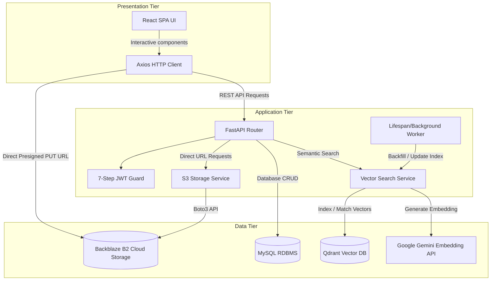
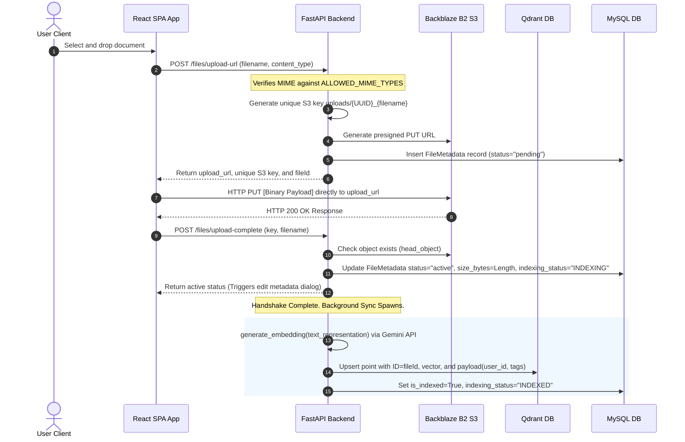
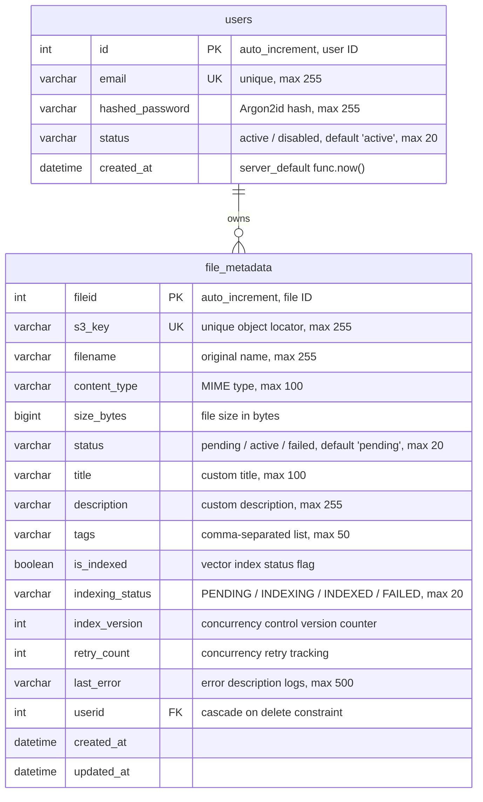

# System Overview: Personal Knowledge Base

## 1. Executive System Summary

The **Personal Knowledge Base** is a secure, multi-tenant cloud document vault designed to solve the problem of personal information overload by providing a centralized repository for storing, managing, and search-retrieving documents. The system allows users to store personal files (.pdf, .docx, .txt, .md) and dynamically index them for semantic AI-driven queries.

### Core Capabilities
1. **Direct-to-Cloud Upload Pipeline:** Solves backend memory choking and data transfer bottlenecks by allowing clients to request presigned S3/Backblaze B2 upload URLs and stream files directly to cloud storage. This keeps file payloads completely decoupled from backend routing memory.
2. **Multi-Tenant Data Isolation:** Isolates files and database metadata strictly using logical separation enforced via a 7-step JSON Web Token (JWT) validation pipeline. A user can only access, search, view, or modify files that belong to their specific database user ID.
3. **AI Semantic Vector Search:** Employs the `google-genai` SDK and Google's `gemini-embedding-2` model to transform structured file metadata into 768-dimensional float vectors, providing query understanding beyond simple keyword matching.
4. **Search Resilience & Fallback:** Implements error boundaries that automatically detect vector service degradation or poor vector query results (under similarity score thresholds), providing fallback structures for client UI consistency.

---

## 2. Technology Stack & Runtime Environment

The application is built on a decoupled full-stack architecture using industry-standard tools:

### Backend Layer
- **Language & Runtime:** Python >= 3.12 running inside a virtual environment ([backend/.venv](file:///d:/Personal_Knowledge_Base/backend/.venv)).
- **Package Manager:** `uv` handles dependency locking via [pyproject.toml](file:///d:/Personal_Knowledge_Base/backend/pyproject.toml) and [uv.lock](file:///d:/Personal_Knowledge_Base/backend/uv.lock).
- **Web Server & ASGI:** FastAPI (`0.141.1`) running on Uvicorn (`0.52.4`) ASGI web server, providing fast, type-safe API routing using async declaration blocks.
- **ORM & Migrations:** SQLAlchemy (`2.0` syntax) manages session transactions, mapping Python classes to MySQL tables with automatic connection pooling. Alembic (`1.19.1`) handles schema revisioning and updates.
- **Crypto & Security:** User registration password hashing is completed using Argon2id (`argon2-cffi` `25.1.0` / `pwdlib` `0.3.1` / `passlib` `1.7.4`) to protect credential stores. Single-session JWT authentication is processed using `python-jose` (`3.5.0`) via HMAC-SHA256 signatures.
- **AI Integrations:** `google-genai` (`2.20.0`) provides access to `gemini-embedding-2` for 768-dimensional vector embedding generation. `qdrant-client` (`1.19.0`) interfaces with the vector search engine.
- **Cloud Storage Client:** `boto3` (`1.43.82`) generates presigned URLs for client uplink.

### Frontend Layer
- **Bundler:** Vite (`8.2.2`) with `@vitejs/plugin-react` (`6.1.0`) compiling and hot-reloading components.
- **Library:** React (`19.2.8`) SPA utilizing functional hooks, refs, and state selectors.
- **UI Framework:** Material UI (`@mui/material` `9.3.1`) styling layout boundaries with the Emotion CSS-in-JS engine (`@emotion/react` `11.14.0`, `@emotion/styled` `11.14.1`).
- **HTTP Client:** Axios (`1.19.0`) intercepts requests to attach Authorization headers and catch session expiries.

### Storage & Database Infrastructure
- **Relational Database:** MySQL (`8.0`) mapping accounts and uploaded metadata records.
- **Vector Database:** Qdrant Vector DB storing vector points in the `document_vault` collection.
- **Object Storage:** Backblaze B2 S3-Compatible Storage bucket hosting documents.

---

## 3. Architecture & System Design

The system relies on an asynchronous, decoupled architecture to separate HTTP transactions from computational AI operations (embedding generation and vector indexing).

### Logical Architecture Diagram



---

## 4. Directory & Module Breakdown

The codebase is organized to maintain a separation of concerns, isolating controllers, service wrappers, schemas, and UI layout components:

```
Personal_Knowledge_Base/
├── .agents/                          # Agent settings and constraints
│   ├── rules.md                      # Codebase guardrails and API isolation rules
│   └── skills.md                     # Active technology and skill inventory
├── backend/                          # Backend application root
│   ├── app/                          # Main application module
│   │   ├── apis/
│   │   │   └── routes/               # API endpoints
│   │   │       ├── auth.py           # Registration, login, and in-memory login rate-limiting
│   │   │       ├── upload_file.py    # Handshake URL hooks, metadata PATCH, delete, and search
│   │   │       └── system.py         # Diagnostic system checks (ping/pong)
│   │   ├── auth/
│   │   │   └── auth.py               # 7-Step JWT dependency pipeline enforcing active state check
│   │   ├── core/
│   │   │   ├── config.py             # Pydantic settings loading and validating env configs
│   │   │   └── security.py           # Argon2id password hashers & JWT signature encoders
│   │   ├── database/
│   │   │   ├── database.py           # SQLAlchemy engine setup & get_db session generator
│   │   │   └── db_models.py          # MySQL schema tables (User, FileMetadata columns)
│   │   ├── schemas/
│   │   │   ├── file.py               # File validation & upload response Pydantic models
│   │   │   └── schemas.py            # User registration / login Pydantic models
│   │   └── services/
│   │       ├── AI/
│   │       │   └── vector_service.py # Google GenAI embeddings & Qdrant collection wrappers
│   │       └── AWS/
│   │           └── s3_service.py     # Boto3 client configuration & filename sanitation
│   ├── main.py                       # FastAPI entrypoint, lifespan startup tasks & CORS middleware
│   └── tests/                        # Pytest suites
│       ├── integration/              # Integration endpoint tests (SQLite in-memory)
│       └── unit/                     # Business logic and crypto tests
├── frontend/                         # Frontend Vite-React project
│   ├── src/                          # Source code directory
│   │   ├── apis/                     # Endpoint API integrations
│   │   │   ├── authApi.js            # Calls backend /auth endpoints using Axios
│   │   │   ├── axiosClient.js        # Central Axios client handling request/response interceptors
│   │   │   ├── documentApi.js        # Requests S3 urls, deletes, updates metadata
│   │   │   └── systemApi.js          # Health check integrations (ping system)
│   │   ├── components/               # React presentation components
│   │   │   ├── DeleteConfirmDialog.jsx # Confirmation dialog for deleting documents
│   │   │   ├── EditMetadataDialog.jsx  # Form fields modal to update titles, descriptions, and tags
│   │   │   ├── FileList.jsx          # File rows mapping and score displays
│   │   │   ├── FileRow.jsx           # Individual file table representation
│   │   │   ├── Header.jsx            # User email display & status ping indicator
│   │   │   └── SearchHeader.jsx      # Query entry field & drag-and-drop file inputs
│   │   ├── pages/
│   │   │   └── AuthPage.jsx          # Login/Register toggle panels and forms
│   │   ├── services/
│   │   │   └── authService.js        # Local token storage encoders/decoders
│   │   └── App.jsx                   # Central page state compiler and design system
└── others/                           # Environment setup files
    └── .env                          # Local credentials storage file
```

---

## 5. Data Flow & Request Lifecycle

### Request Lifecycle: Direct File Upload
The direct upload lifecycle prevents large files from choking memory or timeout limits on the Python backend server:



### Request Lifecycle: Multi-Tenant Semantic Search
The system filters vector similarities based on tenant owners to prevent cross-account disclosures:

1. **Client Query Dispatch:** The user types a query in the frontend, debounced at 350ms, sending an Axios GET request to `/files/search?q=query` with the bearer JWT.
2. **Query Validation:** The backend validates query parameters in [upload_file.py](file:///d:/Personal_Knowledge_Base/backend/app/apis/routes/upload_file.py):
   - Reject queries over 100 characters or whitespace-only queries with `HTTP 422 Unprocessable Entity`.
3. **Query Embedding:** The backend calls `generate_embedding` to transform the text query into a 768-dimension vector using Google Gemini.
4. **Vector Search & Scoped Filtering:** The vector client sends queries to Qdrant using the `qdrant_client.models.Filter` constraint mapping `user_id == current_user.id` and a score threshold of `0.55`.
5. **Relational Lookup & Delivery:** The query returns matched point IDs, which are looked up in the MySQL database [db_models.py](file:///d:/Personal_Knowledge_Base/backend/app/database/db_models.py) to return full metadata structures and similarity scores to the client.

---

## 6. Data Modeling & Schema

### Relational Schema Diagram (MySQL)
The database schema consists of a standard one-to-many relationship mapping users to uploaded files:



### Vector Database Schema (Qdrant)
- **Collection Name:** `document_vault`
- **Vector Dimension:** 768 float dimensions
- **Metric Type:** Cosine Similarity (`models.Distance.COSINE`)
- **Payload Indexing:**
  - `user_id` (Integer index) for tenant routing
  - `tags` (Keyword index) for category matching
- **Payload Schema:**
  ```json
  {
    "file_id": 10,
    "user_id": 1,
    "filename": "annual_report.pdf",
    "title": "2026 Financials",
    "tags": "finance,report",
    "description": "Annual statements for Backblaze systems"
  }
  ```

---

## 7. API & Interface Design

All backend endpoints are documented in the table below:

| HTTP Method | Route Pathway | Required Payload | Success Output (200/201) | Security Guards / Constraints |
| :--- | :--- | :--- | :--- | :--- |
| **POST** | `/auth/register` | `UserRegister` | `UserOut` | Checks password matches, enforces unique email constraints. |
| **POST** | `/auth/login` | `UserLogin` | `Token` | Verifies passwords. Rate limits IPs and accounts to 5 attempts per 15 minutes. |
| **POST** | `/auth/login/form` | Form Fields | `Token` | Swagger interface login helper mapping. |
| **GET** | `/system/ping` | None | `{"status": "ok"}` | Connection check. Public route. |
| **POST** | `/files/upload-url` | `FileUploadRequest` | `PresignedUrlResponse` | Generates safe keys and inserts pending records. Requires active JWT. |
| **POST** | `/files/upload-complete`| `FileUploadCompleteRequest`| `FileUploadCompleteResponse`| Validates S3 uploads and initiates background embedding sync. JWT guard. |
| **POST** | `/files/view-url` | `FileViewUrlRequest` | `FileViewUrlResponse` | Resolves short-lived presigned GET URLs (expires in 300s). JWT guard. |
| **GET** | `/files` | None | `list[FileMetadataSchema]` | Returns active metadata files owned by the tenant. JWT guard. |
| **PATCH** | `/files/{fileid}` | `FileMetadataUpdateRequest`| `FileMetadataSchema` | Updates metadata fields and schedules vector re-indexing. JWT guard. |
| **GET** | `/files/search` | Query params: `q` | `SearchResponseSchema` | Validates query character lengths <= 100. Returns semantic results. |
| **DELETE** | `/files/{fileid}` | None | Success object confirmation | Removes files from S3, vectors from Qdrant, and rows from MySQL. |

### Payload Schema Definitions

#### UserRegister Schema
- **email**: String (valid format, max length 255)
- **password**: String (min length 8)
- **confirm_password**: String (min length 8, must match `password`)

#### UserLogin Schema
- **email**: String (valid format, max length 255)
- **password**: String (required)

#### Token Schema
- **access_token**: String (JWT token value)
- **token_type**: String (default: "bearer")

#### FileUploadRequest Schema
- **filename**: String (min length 1, max length 255)
- **contentType**: String (must match `"application/pdf"`, `"application/vnd.openxmlformats-officedocument.wordprocessingml.document"`, `"text/plain"`, or `"text/markdown"`)

#### FileMetadataUpdateRequest Schema
- **title**: String (Optional, max length 100)
- **description**: String (Optional, max length 255)
- **tags**: String (Optional, max length 50, comma-separated chips)

### The 7-Step JWT Validation Pipeline
FastAPI enforces security using dependencies defined in [auth.py](file:///d:/Personal_Knowledge_Base/backend/app/auth/auth.py):
1. **Extraction:** Verify the Authorization header is present with a valid `Bearer <token>` format.
2. **Signature Verification:** Confirm the token is validly signed with the server's symmetric `SECRET_KEY` using HS256.
3. **Expiration check:** Reject requests if the `exp` claim has passed.
4. **Claim Identification:** Ensure the `sub` (subject) claim is declared.
5. **Type Parsing:** Confirm the `sub` claim converts to a valid integer database primary key.
6. **User Existence:** Check the MySQL database to ensure the user ID exists in the database.
7. **Status check:** Verify the user status equals `active`. Accounts labeled `disabled` receive a `403 Forbidden` response.

---

## 8. Configuration & Environment

The application configuration parameters are managed using Pydantic Settings in [config.py](file:///d:/Personal_Knowledge_Base/backend/app/core/config.py), loading variables from the environment file located at [others/.env](file:///d:/Personal_Knowledge_Base/others/.env):

| Configuration Variable | Expected Type | Purpose & Integration |
| :--- | :--- | :--- |
| `DATABASE_URL` | String | MySQL connection URL used by SQLAlchemy and Alembic. |
| `SECRET_KEY` | String | Symmetric key used to sign JWT authorization tokens. |
| `AWS_ACCESS_KEY_ID` | String | Cloud storage access key ID (e.g. Backblaze credentials). |
| `AWS_SECRET_ACCESS_KEY` | String | Cloud storage application credentials. |
| `AWS_REGION` | String | Region locator parameter (default: `ap-south-1`). |
| `AWS_ENDPOINT_URL` | String | Endpoint override routing URL for Backblaze API. |
| `S3_BUCKET_NAME` | String | Targeted bucket container name (default: `personal-knowledge-base`). |
| `S3_PRESIGNED_URL_EXPIRY`| Integer | URL lifespan validity period in seconds (default: `3600`). |
| `GEMINI_API_KEY` | String | Authorization key accessing Google Gemini embedding API. |
| `QDRANT_HOST` | String | Connection locator host for Qdrant service (default: `http://localhost:6333`). |
| `QDRANT_COLLECTION_NAME` | String | Target similarity vault collection (default: `document_vault`). |
| `VITE_API_URL` | String | Port mapping address used to host Uvicorn (default: `http://localhost:8000`). |

---

## 9. Development, Build & Deployment Workflows

### Virtual Environment Setup
Before execution, configure a virtual Python package environment inside the backend directory:
```powershell
# Navigate to backend and create environment
cd backend
uv venv
.venv\Scripts\activate

# Install locked requirements dependencies
uv pip install -r requirements.txt
```

### Relational Database Migrations
When schema changes are added to [db_models.py](file:///d:/Personal_Knowledge_Base/backend/app/database/db_models.py), run Alembic to generate schema updates:
```powershell
# In backend/ directory
# Generate migration script
alembic revision --autogenerate -m "describe_changes"

# Apply migrations to local MySQL instance
alembic upgrade head
```

### Running Services Locally

#### Backend ASGI Server
To spin up the web API locally:
```powershell
# Start Uvicorn from the backend/ directory with hot-reload enabled
python main.py
```

#### Frontend Development Server
Configure dependencies and host the Vite development environment:
```powershell
# Navigate to frontend and install npm packages
cd frontend
npm install

# Launch Vite development environment
npm run dev
```

### Executing Tests
The backend integration test suite runs inside a virtual environment using SQLite memory pools:
```powershell
# In backend/ directory, run test execution
pytest tests/ -v
```
