# Personal Knowledge Base (PKB) — Production-Ready Project Plan

**Author:** Engineering Plan prepared for Shanmugaraj
**Role framing:** Senior FastAPI Backend Architecture
**Version:** 1.0
**Scope:** V1 (Core CRUD + S3 + Summarization) → V2 (Semantic Search + Plugins) → V3 (Multi-source RAG)

---

## Table of Contents

1. [Executive Summary](#1-executive-summary)
2. [Tech Stack](#2-tech-stack)
3. [High-Level System Architecture](#3-high-level-system-architecture)
4. [Database Design](#4-database-design)
5. [Repository / Folder Structure](#5-repository--folder-structure)
6. [Phase-Wise Delivery Plan](#6-phase-wise-delivery-plan)
7. [V1 — Core Platform (Detailed)](#7-v1--core-platform-detailed)
8. [V2 — Semantic Search + Plugins (Detailed)](#8-v2--semantic-search--plugins-detailed)
9. [V3 — Multi-Source RAG (Detailed)](#9-v3--multi-source-rag-detailed)
10. [API Design (V1 Contract)](#10-api-design-v1-contract)
11. [S3 Upload Strategy](#11-s3-upload-strategy)
12. [Security & Auth](#12-security--auth)
13. [Background Jobs & Async Processing](#13-background-jobs--async-processing)
14. [Observability](#14-observability)
15. [Deployment & CI/CD](#15-deployment--cicd)
16. [Testing Strategy](#16-testing-strategy)
17. [Cost Estimation (AWS + Gemini + Qdrant)](#17-cost-estimation)
18. [Open Source References](#18-open-source-references)
19. [Milestone Timeline](#19-milestone-timeline)
20. [Risk Register](#20-risk-register)

---

## 1. Executive Summary

**Personal Knowledge Base (PKB)** is a system that lets a user upload files directly to AWS S3, manage rich metadata (title, label, description) on those files, perform CRUD on that metadata, and use Gemini API to summarize file content on demand.

The system is designed to evolve in three clean phases without re-architecting the core:

- **V1** — File upload (direct-to-S3), metadata CRUD, AI summarization. Ships fast, proves the core loop.
- **V2** — Semantic search over file content using Qdrant, plus plugin-based ingestion from external sources (Google Drive, GitHub).
- **V3** — Full Retrieval-Augmented Generation (RAG) across all sources — S3 files, Google Drive, GitHub repos — with a unified conversational query interface.

The architecture is intentionally **service-oriented within a modular monolith** for V1–V2 (not microservices — that would be premature for a solo/small-team project), with clear internal boundaries so it can be split into services later if scale demands it. This mirrors the approach used by production-grade open source references like `fastapi-best-practices` (zhanymkanov) and `full-stack-fastapi-template` (tiangolo/Astral) — domain-based folder structure, not layer-based.

---

## 2. Tech Stack

| Layer | Technology | Notes |
|---|---|---|
| Backend framework | FastAPI (async) | Already have auth; extend it |
| Language | Python 3.12 | Use `uv` or `poetry` for dependency mgmt |
| Database | MySQL 8 | Users, file metadata, job status |
| ORM | SQLAlchemy 2.0 (async) + Alembic | Async engine w/ `aiomysql` or `asyncmy` |
| Object storage | AWS S3 | Direct-to-S3 presigned upload/download |
| Vector DB (V2+) | Qdrant | Self-hosted (Docker) or Qdrant Cloud |
| LLM | Gemini API (`gemini-2.5-flash` / `pro`) | Summarization, embeddings (V2), RAG (V3) |
| Frontend (optional) | ReactJS + MUI | Consumes REST API |
| Task queue | Celery + Redis, or FastAPI `BackgroundTasks` → ARQ | Async summarization/embedding jobs |
| Cache | Redis | Rate limiting, job status, session cache |
| Containerization | Docker + Docker Compose | Local dev parity |
| CI/CD | GitHub Actions | Lint, test, build, deploy |
| Infra (prod) | AWS ECS Fargate / EC2 + RDS MySQL + S3 + ElastiCache | Or simpler: single EC2 + Docker Compose for MVP |
| Migrations | Alembic | Versioned, auto-generated |
| Validation | Pydantic v2 | Request/response schemas, settings |
| Auth | JWT (already implemented) | Extend with scopes/roles if needed |

---

## 3. High-Level System Architecture

### 3.1 V1 Architecture

```mermaid
flowchart LR
    subgraph Client
        FE[ReactJS + MUI SPA]
    end

    subgraph API["FastAPI Backend (EC2 / ECS Fargate)"]
        AUTH[Auth Module\n(existing JWT)]
        FILES[Files Module\nCRUD metadata]
        UPLOAD[Upload Module\nPresigned URL Service]
        SUMMARY[Summarizer Module]
        WORKER[Background Worker\nCelery/ARQ]
    end

    subgraph AWS
        S3[(AWS S3\nRaw Files)]
    end

    subgraph DB["MySQL (RDS)"]
        USERS[(users)]
        FILEMETA[(file_metadata)]
        JOBS[(summary_jobs)]
    end

    REDIS[(Redis\nQueue + Cache)]
    GEMINI[Gemini API]

    FE -->|1. Login| AUTH
    FE -->|2. Request presigned URL| UPLOAD
    UPLOAD -->|3. Return presigned PUT URL| FE
    FE -->|4. PUT file directly| S3
    FE -->|5. Confirm upload + metadata| FILES
    FILES --> FILEMETA
    AUTH --> USERS

    FE -->|6. Request summary| SUMMARY
    SUMMARY --> WORKER
    WORKER -->|fetch file| S3
    WORKER -->|call LLM| GEMINI
    WORKER --> JOBS
    WORKER --> REDIS
    SUMMARY -->|poll/status| REDIS
```

**Key design decision:** files go **client → S3 directly** via a presigned URL, not through the FastAPI server. This avoids streaming large files through the API process, keeps the backend stateless, and is how every serious open source file-manager (e.g. `filestash`, `nextcloud`'s S3 backend, `chibisafe`) handles large uploads.

### 3.2 V2 Architecture (adds semantic search + plugins)

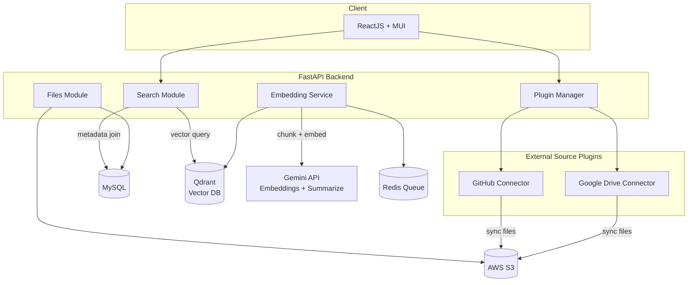

### 3.3 V3 Architecture (RAG across sources)

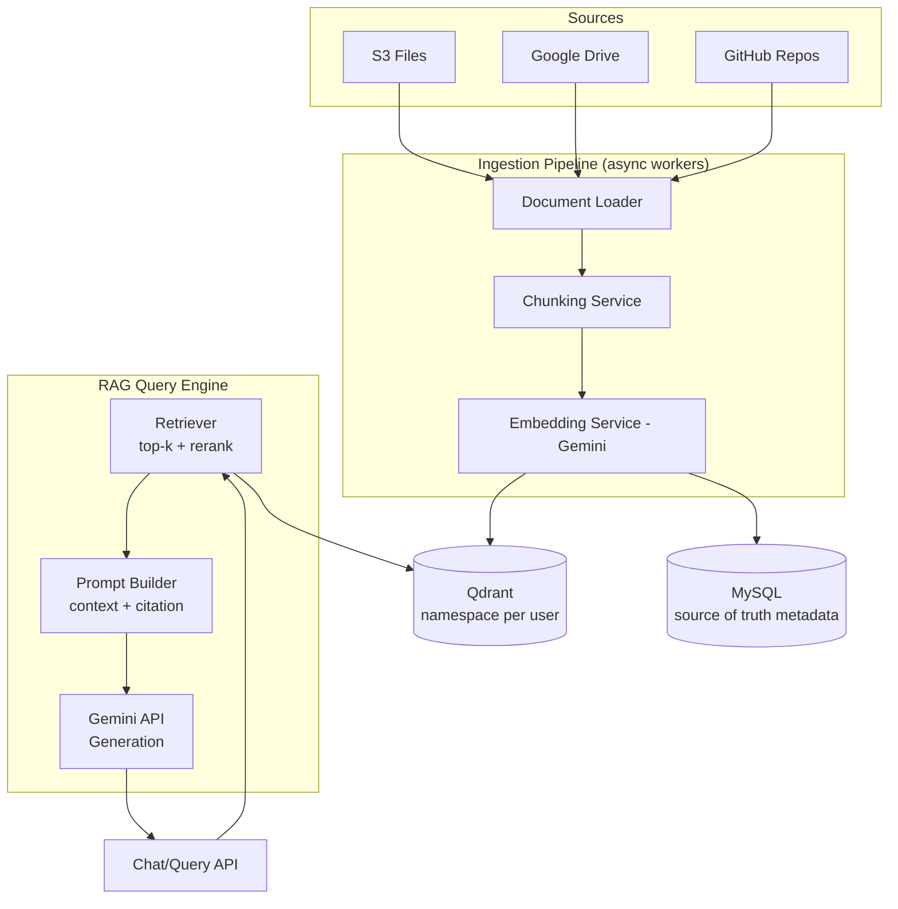

---

## 4. Database Design

### 4.1 Entity Relationship Diagram

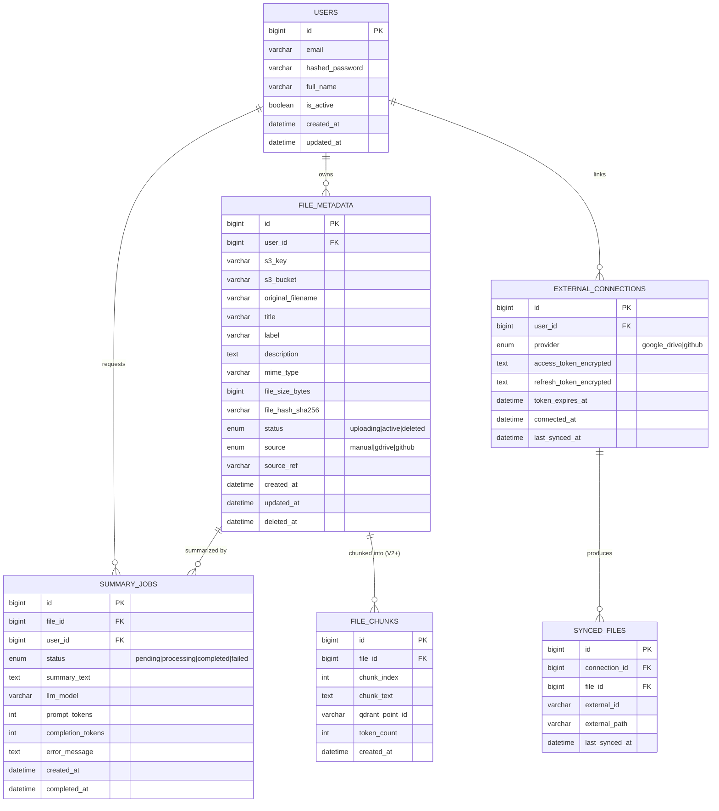

### 4.2 Table Notes

- **`users`** — already exists per your note; shown here for FK completeness.
- **`file_metadata`** — the core table. `s3_key` is the canonical pointer to the object; `status` allows soft-delete (`deleted_at`) so S3 cleanup can be a separate reconciliation job rather than a synchronous delete.
- **`file_hash_sha256`** — dedupe detection; also lets you skip re-embedding unchanged files.
- **`summary_jobs`** — decoupled from `file_metadata` so a file can be re-summarized (different prompt/model) without mutating the file row. Keeps an audit trail of token usage/cost.
- **`file_chunks`** (V2+) — only populated once semantic search ships. `qdrant_point_id` links MySQL row ↔ vector in Qdrant, so Qdrant remains the vector index while MySQL remains the source of truth (standard pattern used by `qdrant`'s own reference RAG apps and `LlamaIndex`/`LangChain` MySQL+vector store integrations).
- **`external_connections`** (V2+) — OAuth tokens for Google Drive / GitHub, encrypted at rest (see §12).
- **Indexes:** `file_metadata(user_id, status)`, `file_metadata(user_id, label)`, `summary_jobs(file_id)`, `file_chunks(file_id)`.

### 4.3 Alembic Migration Convention

```
migrations/versions/
  0001_create_file_metadata.py
  0002_create_summary_jobs.py
  0003_add_source_columns_to_file_metadata.py   (V2 prep)
  0004_create_external_connections.py            (V2)
  0005_create_file_chunks.py                      (V2)
```
Never edit a merged migration — always add a new one. This is the convention used in `full-stack-fastapi-template` and is non-negotiable for a table that will be under active development.

---

## 5. Repository / Folder Structure

Following the **domain-driven, not layer-driven** structure recommended by `fastapi-best-practices` (the most-starred community FastAPI conventions repo) instead of the tutorial-style `routers/`, `models/`, `schemas/` split at the top level:

```
pkb-backend/
├── src/
│   ├── auth/                      # already exists — extend, don't rewrite
│   │   ├── router.py
│   │   ├── schemas.py
│   │   ├── service.py
│   │   ├── models.py
│   │   └── dependencies.py
│   │
│   ├── files/                     # V1 core
│   │   ├── router.py              # CRUD endpoints
│   │   ├── schemas.py             # Pydantic models
│   │   ├── models.py              # SQLAlchemy ORM
│   │   ├── service.py             # business logic
│   │   ├── repository.py          # DB access layer
│   │   ├── exceptions.py
│   │   └── constants.py
│   │
│   ├── uploads/                   # V1 — presigned URL logic
│   │   ├── router.py
│   │   ├── service.py             # boto3 presigned URL generation
│   │   └── schemas.py
│   │
│   ├── summarization/             # V1 — Gemini summarizer
│   │   ├── router.py
│   │   ├── service.py             # prompt templates + Gemini calls
│   │   ├── tasks.py                # Celery/ARQ task
│   │   ├── schemas.py
│   │   └── prompts/
│   │       └── summarize_v1.txt
│   │
│   ├── search/                    # V2 — semantic search
│   │   ├── router.py
│   │   ├── service.py
│   │   ├── embeddings.py
│   │   └── qdrant_client.py
│   │
│   ├── plugins/                   # V2 — external integrations
│   │   ├── base.py                # abstract PluginConnector interface
│   │   ├── google_drive/
│   │   │   ├── connector.py
│   │   │   └── oauth.py
│   │   └── github/
│   │       ├── connector.py
│   │       └── oauth.py
│   │
│   ├── rag/                       # V3
│   │   ├── router.py
│   │   ├── retriever.py
│   │   ├── prompt_builder.py
│   │   └── chat_service.py
│   │
│   ├── core/                      # cross-cutting
│   │   ├── config.py              # Pydantic Settings
│   │   ├── database.py            # async engine/session
│   │   ├── security.py            # JWT, encryption helpers
│   │   ├── s3_client.py
│   │   ├── redis_client.py
│   │   ├── logging.py
│   │   ├── exceptions.py          # global exception handlers
│   │   └── middleware.py
│   │
│   └── main.py                    # FastAPI app factory
│
├── migrations/                    # Alembic
├── tests/
│   ├── unit/
│   ├── integration/
│   └── conftest.py
├── scripts/
│   ├── seed_db.py
│   └── reconcile_s3_orphans.py
├── docker/
│   ├── Dockerfile
│   └── docker-compose.yml
├── .github/workflows/
│   ├── ci.yml
│   └── deploy.yml
├── alembic.ini
├── pyproject.toml
├── .env.example
└── README.md
```

This mirrors `netflix/dispatch`'s and `zhanymkanov/fastapi-best-practices`' guidance: **each domain package owns its router, schema, model, service, and exceptions** — nothing is scattered across a global `models.py`. It also means V2's `search/` and `plugins/` and V3's `rag/` slot in without touching `files/` internals.

---

## 6. Phase-Wise Delivery Plan

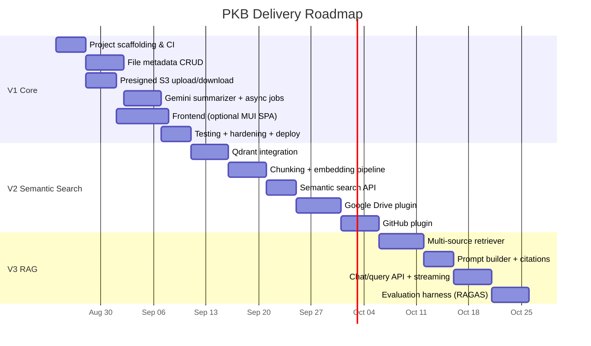

---

## 7. V1 — Core Platform (Detailed)

### 7.1 Goals
- User uploads file directly to S3 (no proxying through API).
- User creates/edits/deletes metadata (title, label, description) for their files.
- User triggers AI summarization of a file; job runs async; user polls or gets notified.
- Everything scoped strictly to the authenticated user (row-level ownership check on every query).

### 7.2 Upload Flow (Sequence)

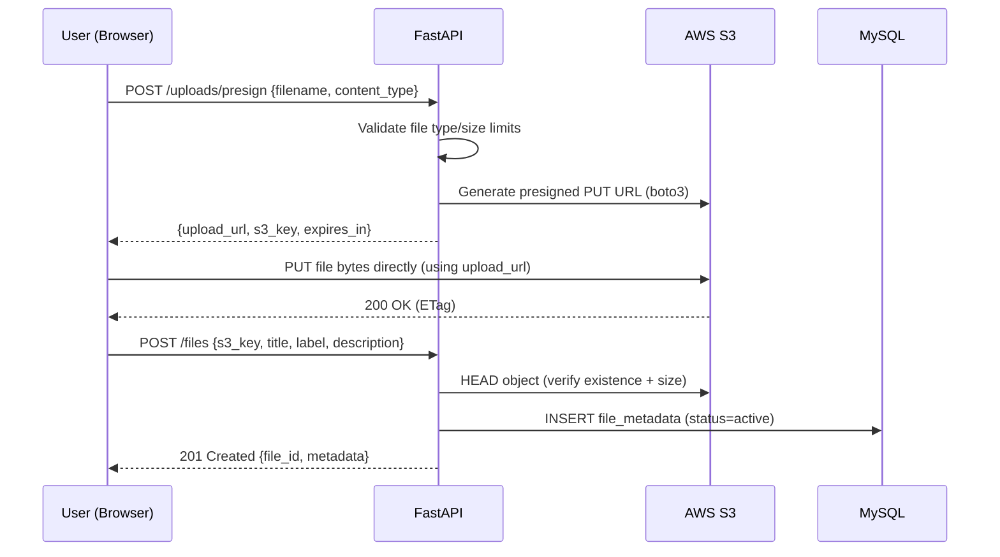

**Why HEAD-verify before DB insert?** Prevents "ghost" metadata rows pointing to files that never actually landed in S3 (client closed tab mid-upload). This pattern is used in `django-storages` + presigned-URL reference implementations and AWS's own "Direct Upload to S3" guidance.

### 7.3 Summarization Flow (Sequence)

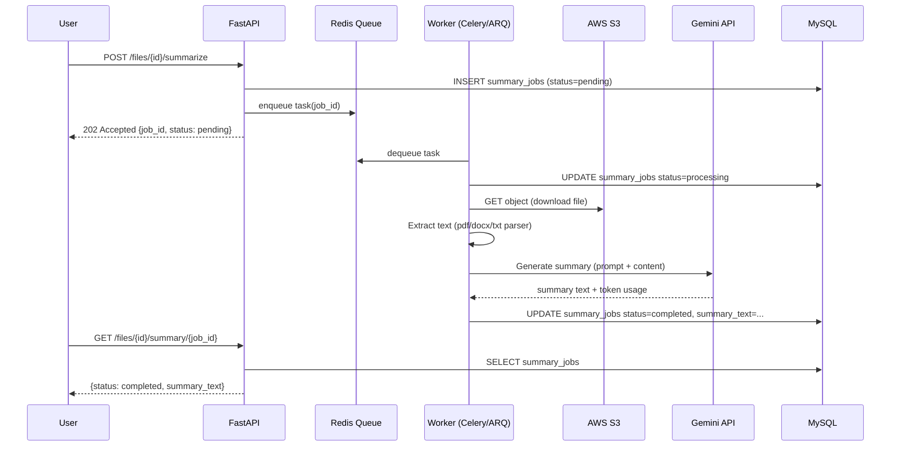

### 7.4 File Type Handling (Text Extraction)

| File type | Extraction method |
|---|---|
| `.pdf` | `pypdf` / `pdfplumber` |
| `.docx` | `python-docx` |
| `.txt`, `.md` | direct read |
| `.csv`, `.xlsx` | `pandas` (row/column summary + sample) |
| images | Gemini multimodal (send image directly, skip text extraction) |

Cap extracted text at a token budget (e.g., first N tokens) before sending to Gemini to control cost — truncate with a clear "content truncated" note appended to the prompt.

### 7.5 Async Job Pattern — Why Not Just `BackgroundTasks`?

FastAPI's built-in `BackgroundTasks` runs in-process and is fine for V1's low volume, **but** it dies if the server restarts mid-job and doesn't scale across multiple API replicas. Recommendation:

- **MVP (single instance):** `BackgroundTasks` is acceptable to ship faster.
- **Production-ready (recommended):** Celery + Redis (mature, huge ecosystem) or **ARQ** (lightweight, async-native, simpler than Celery, purpose-built for FastAPI-style async apps). ARQ is the better fit here since your whole stack is already async.

---

## 8. V2 — Semantic Search + Plugins (Detailed)

### 8.1 Chunking + Embedding Pipeline

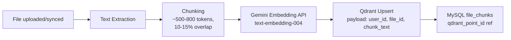

**Qdrant collection design:**
- One collection per environment (e.g. `pkb_chunks`), with `user_id` as an indexed payload field — **not** one collection per user (avoids collection-sprawl; Qdrant's payload filtering is efficient for this at the scale of a personal tool).
- Vector size = embedding model dimension (e.g. 768 for `text-embedding-004`).
- Distance metric: Cosine.

### 8.2 Semantic Search API Flow

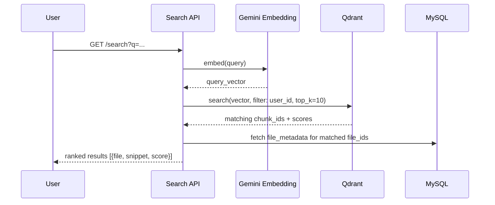

### 8.3 Plugin Architecture (Google Drive / GitHub)

Define a common interface so adding a new source later (Notion, Dropbox, etc.) doesn't touch core code:

```python
# src/plugins/base.py
from abc import ABC, abstractmethod

class PluginConnector(ABC):
    provider: str

    @abstractmethod
    async def authenticate(self, user_id: int, oauth_code: str) -> None: ...

    @abstractmethod
    async def list_files(self, user_id: int) -> list[dict]: ...

    @abstractmethod
    async def fetch_file(self, user_id: int, external_id: str) -> bytes: ...

    @abstractmethod
    async def sync(self, user_id: int) -> "SyncResult": ...
```

- **Google Drive:** OAuth2 (`google-auth`, `google-api-python-client`), sync via `files.list` + `files.export`/`files.get` → push into S3 under `gdrive/{user_id}/...` → create `file_metadata` row with `source=gdrive`.
- **GitHub:** OAuth App or PAT, use `PyGithub` or raw REST, pull repo file tree, download files/READMEs → push to S3 under `github/{user_id}/{repo}/...` → `source=github`.

This "sync external source → normalize into S3 + file_metadata" approach means the rest of the system (summarizer, chunker, search) **never needs to know** where a file originally came from — it's a clean adapter pattern, same as how `Airbyte` and `Unstructured.io` connectors normalize heterogeneous sources into one pipeline.

---

## 9. V3 — Multi-Source RAG (Detailed)

### 9.1 RAG Query Flow

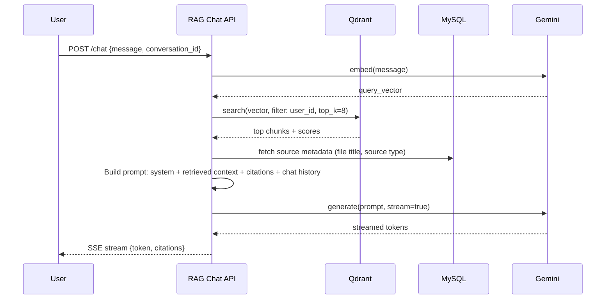

### 9.2 Prompt Construction Principle

- **System prompt:** role, instruction to only answer from provided context, instruction to cite source file names.
- **Context block:** top-k chunks, each tagged with `[Source: filename.pdf, chunk 3]`.
- **Guardrail:** if retrieval score below threshold, respond "I don't have enough information in your knowledge base" rather than hallucinating — critical for a personal knowledge tool where trust matters.

### 9.3 Evaluation

Use **RAGAS** (open source RAG evaluation framework) to track:
- Faithfulness (is the answer grounded in retrieved context?)
- Answer relevancy
- Context precision/recall

Run this as a CI step against a golden test set of Q&A pairs before each RAG-affecting deploy — this is directly relevant to your resume positioning around RAG evals on NEIC, and reusing that same discipline here strengthens both projects as a portfolio narrative.

---

## 10. API Design (V1 Contract)

```
Auth (existing)
  POST   /auth/register
  POST   /auth/login
  POST   /auth/refresh

Uploads
  POST   /api/v1/uploads/presign          → {upload_url, s3_key, expires_in}

Files (CRUD)
  POST   /api/v1/files                     → create metadata record (post-upload)
  GET    /api/v1/files                     → list (paginated, filter by label)
  GET    /api/v1/files/{file_id}           → get one
  PATCH  /api/v1/files/{file_id}           → update title/label/description
  DELETE /api/v1/files/{file_id}           → soft delete
  GET    /api/v1/files/{file_id}/download  → presigned GET URL

Summarization
  POST   /api/v1/files/{file_id}/summarize            → enqueue job, 202
  GET    /api/v1/files/{file_id}/summary/{job_id}      → poll status/result

--- V2 additions ---
Search
  GET    /api/v1/search?q=...&label=...

Plugins
  GET    /api/v1/plugins
  POST   /api/v1/plugins/{provider}/connect
  POST   /api/v1/plugins/{provider}/sync
  DELETE /api/v1/plugins/{provider}/disconnect

--- V3 additions ---
RAG
  POST   /api/v1/chat                       (SSE streaming response)
  GET    /api/v1/chat/{conversation_id}
```

### 10.1 Example Pydantic Schemas

```python
# src/files/schemas.py
from pydantic import BaseModel, Field
from datetime import datetime
from enum import Enum

class FileStatus(str, Enum):
    uploading = "uploading"
    active = "active"
    deleted = "deleted"

class FileCreate(BaseModel):
    s3_key: str
    original_filename: str
    title: str = Field(..., max_length=255)
    label: str | None = Field(None, max_length=100)
    description: str | None = None
    mime_type: str
    file_size_bytes: int

class FileUpdate(BaseModel):
    title: str | None = None
    label: str | None = None
    description: str | None = None

class FileRead(BaseModel):
    id: int
    title: str
    label: str | None
    description: str | None
    mime_type: str
    file_size_bytes: int
    status: FileStatus
    created_at: datetime
    updated_at: datetime

    class Config:
        from_attributes = True
```

---

## 11. S3 Upload Strategy

### 11.1 Bucket Layout

```
s3://pkb-prod-bucket/
  users/{user_id}/manual/{uuid}_{filename}
  users/{user_id}/gdrive/{drive_file_id}_{filename}
  users/{user_id}/github/{repo}/{path}
```

### 11.2 Presigned URL Generation (boto3)

```python
# src/uploads/service.py
import boto3
from uuid import uuid4
from src.core.config import settings

s3_client = boto3.client("s3", region_name=settings.AWS_REGION)

def generate_presigned_upload(user_id: int, filename: str, content_type: str) -> dict:
    key = f"users/{user_id}/manual/{uuid4()}_{filename}"
    url = s3_client.generate_presigned_url(
        ClientMethod="put_object",
        Params={
            "Bucket": settings.S3_BUCKET,
            "Key": key,
            "ContentType": content_type,
        },
        ExpiresIn=300,  # 5 minutes
    )
    return {"upload_url": url, "s3_key": key, "expires_in": 300}
```

### 11.3 Controls
- Enforce max file size client-side AND validate via S3 bucket policy / `Content-Length-Range` in a POST policy if using presigned POST instead of PUT for stricter control.
- Enable **S3 versioning** + **lifecycle rules** (e.g., transition to Glacier after 90 days for rarely-accessed files, or expire soft-deleted files after 30 days).
- Enable **SSE-S3 or SSE-KMS** server-side encryption by default.
- Block public access at the bucket level; all access via presigned URLs only.
- CORS config on the bucket to allow `PUT` from your frontend origin only.

---

## 12. Security & Auth

- **Existing JWT auth** — extend with per-request ownership checks: every `files` query filters `WHERE user_id = current_user.id`, enforced at the repository layer (not just the router) so a bug in one endpoint can't leak cross-user data.
- **Encrypt OAuth tokens at rest** (V2 `external_connections.access_token_encrypted`) using `cryptography.fernet` with a key from AWS Secrets Manager / KMS — never store raw OAuth tokens in MySQL.
- **Presigned URL scoping** — short expiry (5 min for uploads, longer e.g. 15 min for downloads), scoped to a single key, never bucket-wide.
- **Rate limiting** — Redis-backed limiter (e.g. `slowapi`) on `/summarize` and `/chat` endpoints since these hit paid LLM APIs — critical cost control.
- **Input validation** — Pydantic v2 strict mode; reject disallowed MIME types server-side, not just client-side.
- **Secrets management** — `.env` for local dev only; AWS Secrets Manager or SSM Parameter Store in production; never commit `.env`.
- **SQL injection** — SQLAlchemy ORM/Core with bound parameters everywhere; no raw string interpolation.
- **Prompt injection (Gemini)** — treat file content as untrusted input; system prompt explicitly instructs the model not to follow instructions found inside file content, only to summarize/answer about it.

---

## 13. Background Jobs & Async Processing

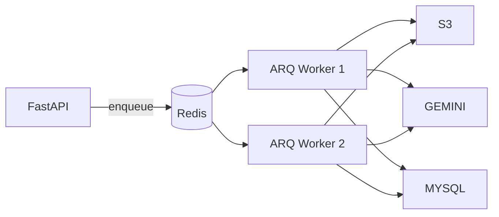

- Workers are horizontally scalable — run 1 worker container in MVP, scale to N under load.
- Idempotency: each job checks `if status == completed: return` before reprocessing (protects against duplicate enqueue/retry).
- Dead-letter handling: after N retries, mark `summary_jobs.status = failed` with `error_message`, surface to user via polling endpoint.

---

## 14. Observability

| Concern | Tool |
|---|---|
| Structured logging | `structlog` or stdlib `logging` with JSON formatter |
| Request tracing | `X-Request-ID` middleware, propagated to worker logs |
| Metrics | Prometheus + Grafana (or CloudWatch if staying AWS-native) |
| Error tracking | Sentry (free tier is enough for a solo project) |
| LLM cost tracking | Log `prompt_tokens`/`completion_tokens` per `summary_jobs` row → aggregate dashboard |
| Health checks | `/health` (liveness) and `/health/ready` (checks DB + Redis + S3 connectivity) |

---

## 15. Deployment & CI/CD

### 15.1 CI Pipeline (GitHub Actions)

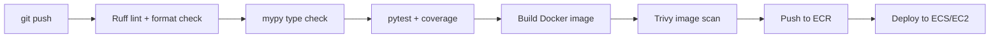

### 15.2 Environments
- **local** — Docker Compose (FastAPI + MySQL + Redis + Qdrant, all containerized).
- **staging** — same infra as prod, smaller instance sizes, separate S3 bucket/DB.
- **production** — RDS MySQL (Multi-AZ optional), ElastiCache Redis, ECS Fargate (or EC2 for lower cost at solo-project scale), S3, Qdrant Cloud or self-hosted on a small EC2.

### 15.3 `docker-compose.yml` (local dev skeleton)

```yaml
services:
  api:
    build: .
    ports: ["8000:8000"]
    env_file: .env
    depends_on: [mysql, redis, qdrant]

  worker:
    build: .
    command: arq src.summarization.tasks.WorkerSettings
    env_file: .env
    depends_on: [mysql, redis]

  mysql:
    image: mysql:8.0
    environment:
      MYSQL_DATABASE: pkb
      MYSQL_ROOT_PASSWORD: rootpass
    ports: ["3306:3306"]
    volumes: ["mysql_data:/var/lib/mysql"]

  redis:
    image: redis:7-alpine
    ports: ["6379:6379"]

  qdrant:
    image: qdrant/qdrant:latest
    ports: ["6333:6333"]
    volumes: ["qdrant_data:/qdrant/storage"]

volumes:
  mysql_data:
  qdrant_data:
```

---

## 16. Testing Strategy

| Layer | Approach |
|---|---|
| Unit | `pytest` + `pytest-asyncio`, mock S3 (`moto`), mock Gemini calls |
| Integration | Testcontainers (spin up real MySQL + Redis in CI) |
| Contract | Pydantic schema validation tests for every endpoint |
| Load | `locust` against `/search` and `/chat` before V2/V3 launch |
| RAG quality | RAGAS golden-set evaluation (§9.3) |

Target: 80%+ coverage on `service.py` and `repository.py` layers (the logic that matters); don't chase 100% on router boilerplate.

---

## 17. Cost Estimation

Rough monthly estimate at small personal-project scale (order-of-magnitude, verify current pricing before committing):

| Item | Estimate |
|---|---|
| RDS MySQL (db.t4g.micro) | ~$15–25/mo |
| S3 storage (50GB) + requests | ~$2–5/mo |
| ECS Fargate / EC2 t3.small | ~$15–30/mo |
| Redis (ElastiCache t4g.micro) | ~$12/mo |
| Qdrant (self-hosted small EC2) | ~$10/mo, or Qdrant Cloud free tier for dev |
| Gemini API (flash model, moderate usage) | Usage-based — track via §14 cost logging |

**Recommendation:** start V1 on a single EC2 instance running Docker Compose (API + worker + Redis + MySQL) to minimize cost, migrate to RDS + ECS once usage justifies it.

---

## 18. Open Source References

Use these as direct structural/pattern references while building:

- **`tiangolo/full-stack-fastapi-template`** — official FastAPI reference stack (FastAPI + SQLModel + Alembic + Docker Compose + CI). Best reference for project skeleton and Alembic setup.
- **`zhanymkanov/fastapi-best-practices`** — the community-standard doc on domain-based folder structure, dependency injection patterns, and async pitfalls. Use for §5 structure.
- **`qdrant/qdrant`** examples repo — reference implementations for chunking + payload filtering patterns used in §8.
- **`explodinggradients/ragas`** — RAG evaluation framework referenced in §9.3.
- **`langchain-ai/langchain`** (document loaders + text splitters modules) — even if you don't adopt LangChain wholesale, its `RecursiveCharacterTextSplitter` logic and document loader interfaces are excellent references for §8.1 and the plugin `base.py` interface in §8.3.
- **`airbytehq/airbyte`** connector pattern — reference for the "normalize heterogeneous external sources into one pipeline" adapter design in §8.3.
- **`googleapis/google-api-python-client`** — official Google Drive API client for the plugin.
- **`PyGithub/PyGithub`** — GitHub API client for the plugin.
- **AWS's official "Uploading to Amazon S3 Directly from a Web or Mobile Application"** guidance — reference for §11 presigned URL security controls.

---

## 19. Milestone Timeline

| Milestone | Target | Deliverable |
|---|---|---|
| M1 | Week 1 | Repo scaffolding, CI green, Docker Compose local env |
| M2 | Week 2–3 | File CRUD + presigned S3 upload/download working end-to-end |
| M3 | Week 3–4 | Async summarization pipeline live (ARQ + Gemini) |
| M4 | Week 4–5 | Optional MUI frontend wired to V1 API |
| **V1 Launch** | Week 5–6 | Deployed, tested, portfolio-ready |
| M5 | Week 7–8 | Qdrant + embedding pipeline + semantic search |
| M6 | Week 9–10 | Google Drive + GitHub plugins |
| **V2 Launch** | Week 10–11 | Deployed |
| M7 | Week 12–13 | Multi-source retriever + prompt builder |
| M8 | Week 14 | Chat API with streaming + citations |
| M9 | Week 15 | RAGAS evaluation harness in CI |
| **V3 Launch** | Week 16 | Full RAG system, portfolio centerpiece |

---

## 20. Risk Register

| Risk | Impact | Mitigation |
|---|---|---|
| Gemini API cost overrun | Medium | Token budgeting, rate limiting, cost logging per §12/§14 |
| Large file text extraction failures (corrupt PDFs, etc.) | Low | Try/except per parser, mark job `failed` with clear error, never crash worker |
| S3 orphaned objects (upload succeeded, metadata insert failed) | Low | Scheduled reconciliation script (`scripts/reconcile_s3_orphans.py`) comparing S3 keys vs `file_metadata` |
| Qdrant/MySQL drift (chunk deleted in one, not other) | Medium | Wrap chunk delete in a transactional-style two-phase operation; nightly consistency check job |
| OAuth token expiry (Google Drive/GitHub) | Low | Refresh token rotation logic in plugin `authenticate()`, alert user on reconnect-required |
| Scope creep before V1 ships | High | Hard freeze V1 scope to §7 only; V2/V3 items explicitly deferred |

---

## Appendix: Quick-Start Commands

```bash
# Local dev
git clone <your-repo>
cd pkb-backend
cp .env.example .env
docker compose up -d mysql redis qdrant
uv sync   # or poetry install
alembic upgrade head
uvicorn src.main:app --reload

# Run worker
arq src.summarization.tasks.WorkerSettings

# Run tests
pytest --cov=src tests/
```

---

*End of document.*
