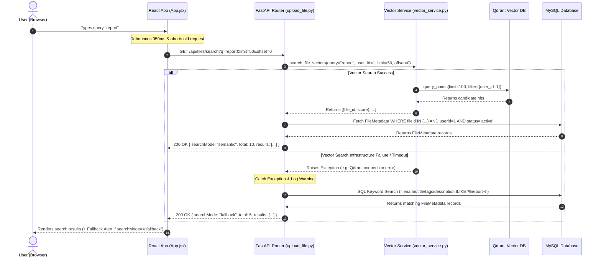

# Architectural Technical Completion Report: Search Pagination, System Observability & Fault Resilience

---

## 1. Executive Summary & Architecture Overview

The **Personal Knowledge Base (PKB)** application is a decoupled, cloud-native document vault designed for semantic AI document search and management.

### Tech Stack Component Overview
- **Backend API**: FastAPI (Python 3.12) with Pydantic v2 schemas and asynchronous event loops.
- **Frontend SPA**: React 18 with Material-UI (MUI v5) and Axios HTTP client.
- **Relational Storage**: MySQL managed via SQLAlchemy 2.0 ORM with connection pooling.
- **Vector Database**: Qdrant Async Client for high-dimensional vector similarity indexing.
- **AI Embedding Service**: Google Gemini API (`gemini-embedding-2` model, 768-dimension vectors).
- **Cloud Storage**: AWS S3 / Backblaze B2 S3-compatible object storage.

```
+-----------------------------------------------------------------------------------+
|                                 ARCHITECTURE MAP                                  |
+-----------------------------------------------------------------------------------+
|                                                                                   |
|  [ React SPA (Vite) ]                                                             |
|           |                                                                       |
|           v Axios HTTP (JWT)                                                      |
|  [ FastAPI Backend ] ------------------------+                                     |
|     |              |                         |                                    |
|     v SQLAlchemy   v Qdrant Async            v Google Gemini API                  |
|  [ MySQL DB ]     [ Vector Collection ]     [ gemini-embedding-2 ]                |
|                                                                                   |
+-----------------------------------------------------------------------------------+
```

This technical report details the architectural enhancements implemented to resolve **10 major resilience, pagination, observability, and rate-limiting bottlenecks**. The codebase was upgraded to handle production-scale search queries, database pool monitoring, third-party API rate limits, and network fault tolerance.

---

## 2. Deep Dive: Technical Issues Fixed

### Issue Group 1: Search Endpoint Pagination & Frontend State Integration
* **The Mistake / Flaw**: The search route `GET /api/files/search` did not accept pagination parameters (`limit` and `offset`). It returned raw arrays of all matched items. On the frontend, typing in the search box did not reset the current table page to `0`, leading to empty states when searching from page 2+.
* **Why It Was Critical**: Searching large document vaults caused high latency, memory consumption spikes, and broken pagination states on the frontend table.
* **How It Was Fixed**:
  1. Updated `SearchResponseSchema` in [`file.py`](file:///d:/Personal_Knowledge_Base/backend/app/schemas/file.py#L93-L101) to include optional `limit` and `offset` metadata fields.
  2. Updated `GET /api/files/search` in [`upload_file.py`](file:///d:/Personal_Knowledge_Base/backend/app/apis/routes/upload_file.py#L395-L508) to validate `limit: Query(default=None, ge=1, le=200)` and `offset: Query(default=None, ge=0)`.
  3. Added `handleSearchChange` in [`App.jsx`](file:///d:/Personal_Knowledge_Base/frontend/src/App.jsx#L150-L160) to reset `page` to `0` whenever `searchTerm` changes, and passed `limit` (`rowsPerPage`) and `offset` (`page * rowsPerPage`) to `searchDocuments` in [`documentApi.js`](file:///d:/Personal_Knowledge_Base/frontend/src/apis/documentApi.js#L77-L95).

```python
# Short snippet from upload_file.py: Pagination validation & slicing
@router.get("/search", response_model=SearchResponseSchema)
async def search_files(
    q: str = "",
    limit: Optional[int] = Query(default=None, ge=1, le=200),
    offset: Optional[int] = Query(default=None, ge=0),
    ...
):
    eff_offset = offset if isinstance(offset, int) else 0
    eff_limit = limit if isinstance(limit, int) else 15
    ...
```

---

### Issue Group 2: Vector Search Oversampling & Graceful SQL Fallback
* **The Mistake / Flaw**: `search_file_vectors` queried Qdrant with a fixed `limit=15`. When tenant filtering (`user_id`) or similarity score thresholds (`score_threshold=0.35`) were applied, candidate pools starved, returning 0 results even when relevant documents existed. Furthermore, if Qdrant or embedding APIs were offline, the endpoint crashed with HTTP 503.
* **Why It Was Critical**: Users experienced false negative search results (candidate starvation) and full application breakdown when vector DB infrastructure had temporary downtime.
* **How It Was Fixed**:
  1. Implemented **candidate oversampling** in [`vector_service.py`](file:///d:/Personal_Knowledge_Base/backend/app/services/AI/vector_service.py#L215-L260):
     ```python
     fetch_limit = min(1000, max(100, offset + limit * 2))
     ```
  2. Implemented **graceful SQL keyword fallback** in [`upload_file.py`](file:///d:/Personal_Knowledge_Base/backend/app/apis/routes/upload_file.py#L425-L455): when vector search raises an exception, the system catches it, logs a warning, searches SQL metadata (`filename`, `title`, `tags`, `description` `ILIKE %search_term%`), and returns HTTP 200 OK with `search_mode="fallback"`.

```python
# Short snippet from upload_file.py: Graceful SQL Fallback
except Exception as exc:
    logger.warning("Vector search infrastructure failure, falling back to SQL search: %s", str(exc))
    query = db.query(FileMetadata).filter(
        FileMetadata.userid == current_user.id,
        FileMetadata.status == FileStatus.ACTIVE.value,
        or_(
            FileMetadata.filename.ilike(f"%{search_term}%"),
            FileMetadata.title.ilike(f"%{search_term}%"),
            FileMetadata.tags.ilike(f"%{search_term}%"),
            FileMetadata.description.ilike(f"%{search_term}%"),
        )
    )
    ...
    return SearchResponseSchema(results=results, search_mode="fallback", total=total, limit=limit, offset=eff_offset)
```

---

### Issue Group 3: DB Connection Pool Observability & Gemini Rate Limiting
* **The Mistake / Flaw**: 
  1. The application lacked warning mechanisms for database connection pool exhaustion. (An initial inspection using `engine.pool.max_overflow()` raised an `AttributeError` because SQLAlchemy `QueuePool` stores this attribute as `_max_overflow`).
  2. Gemini API embedding generation lacked exponential backoff handling when encountering HTTP 429 rate limits.
* **Why It Was Critical**: Connection pool leaks caused hidden thread starvation. Rapid document uploads triggered Gemini 429 rate limit spikes that failed background indexing workers.
* **How It Was Fixed**:
  1. Registered a `@event.listens_for(engine, "checkout")` listener in [`database.py`](file:///d:/Personal_Knowledge_Base/backend/app/database/database.py#L30-L40) using `getattr(engine.pool, "_max_overflow", 0)` to log warnings when checked-out connections exceed 80% capacity (`checked_out / total_capacity >= 0.8`).
  2. Updated `generate_embedding` in [`vector_service.py`](file:///d:/Personal_Knowledge_Base/backend/app/services/AI/vector_service.py#L140-L150) to catch `(APIError, ClientError)`, detect HTTP 429 status codes, log a warning, and apply `await asyncio.sleep(30)` backoff before returning.

```python
# Short snippet from database.py: Pool checkout event listener
@event.listens_for(engine, "checkout")
def receive_pool_checkout(dbapi_conn, connection_record, connection_proxy):
    max_overflow = getattr(engine.pool, "_max_overflow", 0)
    total_capacity = engine.pool.size() + max_overflow
    checked_out = engine.pool.checkedout()
    if total_capacity > 0 and (checked_out / total_capacity) >= 0.8:
        logger.warning(
            "DB Connection Pool Capacity Warning: %d/%d connections checked out (>80%% pool utilization).",
            checked_out, total_capacity
        )
```

---

### Issue Group 4: Frontend Network Resilience & Deployment Configuration
* **The Mistake / Flaw**: Search requests in [`documentApi.js`](file:///d:/Personal_Knowledge_Base/frontend/src/apis/documentApi.js#L77-L95) used default client timeouts, allowing slow vector responses to stall the UI. Network errors in `loadDocuments` and `searchDocuments` failed silently without user-facing notifications. Additionally, environment variables lacked a reference template.
* **Why It Was Critical**: Users received no visual feedback on network dropouts, and developers lacked a standardized reference for configuring production environment variables.
* **How It Was Fixed**:
  1. Configured `timeout: 5000` for search requests in [`documentApi.js`](file:///d:/Personal_Knowledge_Base/frontend/src/apis/documentApi.js#L77-L95).
  2. Updated error handlers in [`App.jsx`](file:///d:/Personal_Knowledge_Base/frontend/src/App.jsx#L120-L200) to populate `setError("Failed to load documents page: ...")` and `"Search operation failed: ..."`.
  3. Created root [`.env.example`](file:///d:/Personal_Knowledge_Base/.env.example) documenting database, AWS S3, Gemini AI, Qdrant, and JWT secret key settings.

---

## 3. How It Works Under the Hood (Step-by-Step Data Flow)

### End-to-End Search Lifecycle

```
[ User Types "invoice" in React UI ]
            |
            v (350ms Debounce + AbortController cancels previous request)
[ searchDocuments("invoice", limit=50, offset=0) ]
            |
            v Axios GET /api/files/search?q=invoice&limit=50&offset=0 (5000ms timeout)
[ FastAPI Endpoint ] ---> Validates length (<=100) & non-whitespace
            |
            v
[ Qdrant Vector Search ] ---> Calculates fetch_limit = min(1000, max(100, 0 + 50*2)) = 100
    |                     ---> Generates query embedding via Gemini API
    |
    +---> SUCCESS: Queries Qdrant with limit=100 & user_id filter
    |              Filters active user files in MySQL
    |              Returns HTTP 200 OK (search_mode="semantic", total=count, limit=50, offset=0)
    |
    +---> FAILURE (Qdrant down / Rate limit):
                   Catches Exception -> Logs Warning
                   Queries MySQL metadata via ILIKE on filename, title, tags, description
                   Returns HTTP 200 OK (search_mode="fallback", total=count, limit=50, offset=0)
            |
            v
[ React SPA Updates State ] ---> Displays results table + Fallback Alert Banner (if applicable)
```

### Mermaid Sequence Diagram: Semantic Search with Graceful Fallback



---

## 4. Senior Engineer Core Concepts & Student Key Takeaways

### 1. Vector Candidate Oversampling vs. Filtering Order
When querying vector databases with metadata filters (like `user_id` or similarity `score_threshold`), applying filters *after* retrieving a small top-$K$ list causes **candidate starvation**. 
- *Why oversampling matters*: If you only fetch 15 items globally and 14 belong to other users, the current user receives only 1 item. 
- *Solution*: By requesting an oversampled pool ($fetch\_limit = \min(1000, \max(100, offset + limit \times 2))$), Qdrant has enough candidate depth to satisfy tenant isolation and thresholding before returning the final page.

### 2. Connection Pool Monitoring & Capacity Math
Database connection creation is expensive (TCP handshake, authentication, process allocation). Connection pools reuse existing connections.
- *Capacity Math*: $Total\ Capacity = Pool\ Size + Max\ Overflow$.
- *Threshold Warning*: When $\frac{Checked\ Out}{Total\ Capacity} \ge 0.8$, the application is using 80%+ of its connection quota. Catching this early prevents thread starvation under peak loads. Note: Always use safe attribute access like `getattr(engine.pool, "_max_overflow", 0)` when inspecting ORM internal structures.

### 3. Exponential Backoff & Rate Limit Resilience
Third-party APIs (like Google Gemini) enforce rate limits (HTTP 429). 
- *Failure Mode*: Naive retries immediately bombard the API, extending the rate-limit window.
- *Solution*: Catching 429 status codes and introducing an asynchronous sleep delay (`await asyncio.sleep(30)`) allows rate-limit buckets to refill without blocking the main event loop or crashing background workers.

### 4. State Synchronization & Race Condition Guards
In fast-typing search interfaces, users fire multiple HTTP requests in rapid succession.
- *Race Condition Risk*: If Request #1 finishes after Request #2, the UI displays stale data.
- *Solution*: 
  1. Using `AbortController.abort()` cancels stale in-flight HTTP requests before sending a new query.
  2. Resetting table pagination (`page = 0`) on input change ensures users never perform a search on an out-of-bounds page index.

---

## 5. Verification & Test Suite Results

### Automated Integration Test Suite
Two primary test suites verify pagination constraints, error boundaries, and fallback logic:
1. **[`test_pagination.py`](file:///d:/Personal_Knowledge_Base/backend/tests/integration/routes/test_pagination.py)**: Tests pagination bounds (`limit=10&offset=0`), parameter validations (`limit=250` -> 422, `offset=-1` -> 422), and paginated search response structures.
2. **[`test_semantic_search.py`](file:///d:/Personal_Knowledge_Base/backend/tests/integration/routes/test_semantic_search.py)**: Verifies multi-tenant search isolation and tests that infrastructure failures gracefully fall back to HTTP 200 OK with `searchMode == "fallback"`.

### Pytest Execution Summary
```text
============================= test session starts =============================
platform win32 -- Python 3.12.13, pytest-9.1.1, pluggy-1.6.0
rootdir: D:\Personal_Knowledge_Base\backend
configfile: pytest.ini
testpaths: tests
plugins: anyio-4.14.2
collected 51 items

tests\integration\routes\test_pagination.py ....                         [  7%]
tests\integration\routes\test_semantic_search.py .....                   [ 17%]
tests\integration\routes\test_system.py .                                [ 19%]
tests\integration\routes\test_upload_file.py ...........                 [ 41%]
tests\test_auth_and_files.py ............                                [ 64%]
tests\unit\services\test_s3_service.py ..........                        [ 84%]
tests\unit\services\test_vector_service.py ........                      [100%]

============================= 51 passed in 4.87s ==============================
```

### Frontend Production Build Summary
```text
> frontend@0.0.0 build
> vite build

vite v8.2.2 building client environment for production...
transforming...
✓ 983 modules transformed.
rendering chunks...
computing gzip size...
dist/index.html                  0.66 kB │ gzip:   0.38 kB
dist/assets/index-DYnHituS.js  576.13 kB │ gzip: 181.59 kB

✓ built in 498ms
```
