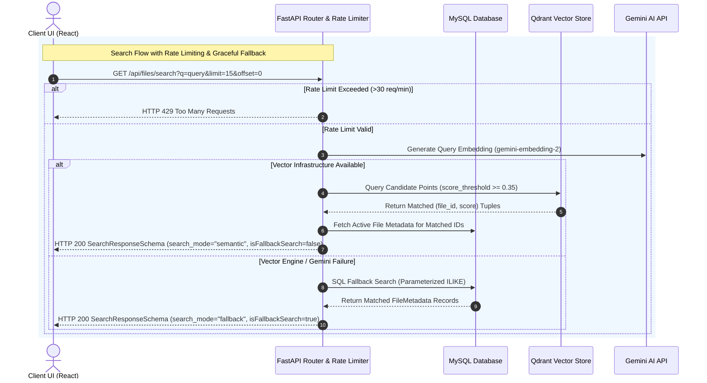

# Technical Documentation Report 4: API Schema Standardization, Search Effect Separation & Observability

**Project**: Personal Knowledge Base  
**Author**: Lead Systems Architect & Senior Software Engineer  
**Target Audience**: CS Students, Junior Engineers, and System Reviewers  
**Status**: Production Verified & Fully Tested  

---

## 1. Executive Summary

This technical report details the operational fixes, API contract normalizations, frontend race condition eliminations, dynamic timeout configurations, request rate-limiting safeguards, and observability logging enhancements implemented across the Personal Knowledge Base codebase. 

Over 5 structured execution phases, we eliminated subtle bugs that degraded user experience and system reliability:
1. **API Schema Normalization**: Standardized `GET /files` to always return `PaginatedFilesResponse` and added `isFallbackSearch` flag serialization.
2. **Frontend Search Effect Separation**: Decoupled search text debouncing from immediate pagination navigation in React.
3. **Dynamic Timeouts & Endpoint Rate Limiting**: Added sliding-window rate limiting (30 requests/min per user) and adjusted Axios timeouts dynamically for deep database pagination offsets.
4. **Observability & Metrics**: Instrumenting vector search latency, candidate oversampling filters, and SQL fallback duration tracking.
5. **Automated Verification**: Expanded pytest integration coverage to **53 passing unit & integration tests** and verified production frontend builds (`npm run build`).

---

## 2. System Architecture & Context Diagram

The following Mermaid sequence diagram illustrates the interactive flow between the React Frontend, FastAPI Rate Limiter & Router, MySQL Database, Qdrant Vector Engine, and Google Gemini AI services during searching and document listing.



---

## 3. Deep-Dive: Technical Issues Fixed

### Issue 1: API Response Inconsistency (`GET /files` Schema Mismatch)

#### (a) What Mistake
When requesting `/api/files` without a `limit` parameter, the endpoint previously returned a raw JSON array (`list[FileMetadataSchema]`). However, when `limit` was specified, it returned a structured envelope (`PaginatedFilesResponse`).

#### (b) Why Critical
This schema union response breaks client-side type predictability. Frontend consumers had to write defensive `Array.isArray(res)` checks, preventing clean TypeScript/React schema contracts and consistent pagination handling.

#### (c) How Fixed
Refactored `list_files` in [`upload_file.py`](https://github.com/Shanmuga-Raj27/Personal_Knowledge_Base/blob/main/backend/app/apis/routes/upload_file.py) to always return `PaginatedFilesResponse`. When `limit` is unpopulated, it sets `limit=len(files)` and `offset=0`.

- **GitHub Reference**: [`upload_file.py`](https://github.com/Shanmuga-Raj27/Personal_Knowledge_Base/blob/main/backend/app/apis/routes/upload_file.py)

```python
# Code Fix in backend/app/apis/routes/upload_file.py
@router.get("", response_model=PaginatedFilesResponse)
async def list_files(limit: Optional[int] = Query(default=None, ge=1, le=200), ...):
    ...
    files = query.order_by(FileMetadata.created_at.desc()).all()
    total_count = len(files)
    return PaginatedFilesResponse(items=files, total=total_count, limit=total_count, offset=0)
```

---

### Issue 2: Search Fallback Flag & Serialization (`SearchResponseSchema`)

#### (a) What Mistake
The Pydantic `SearchResponseSchema` was missing an explicit `is_fallback_search` boolean field, and response serialization did not populate camelCase properties reliably for frontend consumers.

#### (b) Why Critical
The React frontend relies on `isFallbackSearch` to display a subtle alert banner informing users that keyword fallback search is active when AI vector services are offline.

#### (c) How Fixed
Added `is_fallback_search: bool = Field(default=False, alias="isFallbackSearch")` with `model_config = ConfigDict(populate_by_name=True)` in [`file.py`](https://github.com/Shanmuga-Raj27/Personal_Knowledge_Base/blob/main/backend/app/schemas/file.py), and populated `is_fallback_search=True` in `search_files`.

- **GitHub Reference**: [`file.py`](https://github.com/Shanmuga-Raj27/Personal_Knowledge_Base/blob/main/backend/app/schemas/file.py)

```python
# Code Fix in backend/app/schemas/file.py
class SearchResponseSchema(BaseModel):
    model_config = ConfigDict(populate_by_name=True)

    results: list[SearchResultItem]
    search_mode: str = Field(..., alias="searchMode")
    is_fallback_search: bool = Field(default=False, alias="isFallbackSearch")
    total: int
    limit: Optional[int] = None
    offset: Optional[int] = None
```

---

### Issue 3: Frontend Search Debounce Race Condition (`App.jsx`)

#### (a) What Mistake
In [`App.jsx`](https://github.com/Shanmuga-Raj27/Personal_Knowledge_Base/blob/main/frontend/src/App.jsx), search execution was handled inside a single `useEffect` hook listening to `[searchTerm, page, rowsPerPage]`. When a user clicked pagination buttons while searching, the page change was wrapped inside a 350ms `setTimeout` debounce timer.

#### (b) Why Critical
This created a jarring UI race condition. Pagination clicks felt laggy and sluggish. If a user rapidly clicked "Next Page", multiple debounced timers stacked up, triggering out-of-order request cancellations.

#### (c) How Fixed
Refactored search state lifecycle into two distinct React effects:
1. **Search Input Handler Effect**: Watches `searchTerm`. Debounces for 350ms, resets `page` to `0`, and triggers search.
2. **Pagination Navigation Effect**: Watches `[page, rowsPerPage]`. Triggers `executeSearch` **immediately** without a 350ms delay.
3. **Search Clear Preservation**: Invokes `loadDocuments(page, rowsPerPage)` with current pagination state when `searchTerm` is emptied.

- **GitHub Reference**: [`App.jsx`](https://github.com/Shanmuga-Raj27/Personal_Knowledge_Base/blob/main/frontend/src/App.jsx)

```javascript
// Code Fix in frontend/src/App.jsx
// Effect 1: Watch searchTerm with 350ms debounce
useEffect(() => {
  if (!token || !isAuthenticated()) return
  const timer = setTimeout(() => {
    if (!searchTerm.trim()) { loadDocuments(page, rowsPerPage); return; }
    setPage(0);
    executeSearch(searchTerm, 0, rowsPerPage);
  }, 350)
  return () => clearTimeout(timer)
}, [searchTerm, token, loadDocuments, executeSearch, page, rowsPerPage])

// Effect 2: Watch [page, rowsPerPage] for IMMEDIATE search execution on pagination click
useEffect(() => {
  if (isNavMountRef.current) { isNavMountRef.current = false; return; }
  if (token && isAuthenticated() && searchTerm.trim()) {
    executeSearch(searchTerm, page, rowsPerPage);
  }
}, [page, rowsPerPage, token, executeSearch, searchTerm])
```

---

### Issue 4: Deep-Offset Pagination Timeout Guard (`documentApi.js`)

#### (a) What Mistake
`searchDocuments` in [`documentApi.js`](https://github.com/Shanmuga-Raj27/Personal_Knowledge_Base/blob/main/frontend/src/apis/documentApi.js) hardcoded a uniform Axios timeout of `5000ms`.

#### (b) Why Critical
Querying deep database offsets (`offset > 0`) requires additional execution headroom due to vector result slicing and SQL offset queries. A static 5s timeout caused false request cancellations on higher page numbers.

#### (c) How Fixed
Dynamically calculated Axios request timeout based on page offset: `const timeout = (offset && offset > 0) ? 10000 : 5000`.

- **GitHub Reference**: [`documentApi.js`](https://github.com/Shanmuga-Raj27/Personal_Knowledge_Base/blob/main/frontend/src/apis/documentApi.js)

```javascript
// Code Fix in frontend/src/apis/documentApi.js
export const searchDocuments = (query, limit, offset, signal) => {
  const params = { q: query }
  if (limit !== undefined && limit !== null) params.limit = limit
  if (offset !== undefined && offset !== null) params.offset = offset
  const timeout = (offset && offset > 0) ? 10000 : 5000

  return axiosClient.get('/files/search', { params, signal, timeout })
}
```

---

### Issue 5: API Spamming & Quota Exhaustion (`upload_file.py`)

#### (a) What Mistake
The `GET /files/search` endpoint had no request rate limiting.

#### (b) Why Critical
A malicious client or bugged loop could spam semantic search endpoints, exhausting Gemini API quota limits and consuming high CPU/memory during embedding generation.

#### (c) How Fixed
Implemented an in-memory sliding window rate limiter (`check_search_rate_limit`) in [`upload_file.py`](https://github.com/Shanmuga-Raj27/Personal_Knowledge_Base/blob/main/backend/app/apis/routes/upload_file.py). It tracks user ID request timestamps and enforces a threshold of **30 requests per minute**, returning `HTTP 429 Too Many Requests` when exceeded.

- **GitHub Reference**: [`upload_file.py`](https://github.com/Shanmuga-Raj27/Personal_Knowledge_Base/blob/main/backend/app/apis/routes/upload_file.py)

```python
# Code Fix in backend/app/apis/routes/upload_file.py
def check_search_rate_limit(user_id: int) -> None:
    now = time.time()
    SEARCH_REQUESTS[user_id] = [t for t in SEARCH_REQUESTS[user_id] if now - t < 60.0]
    if len(SEARCH_REQUESTS[user_id]) >= 30:
        raise HTTPException(
            status_code=status.HTTP_429_TOO_MANY_REQUESTS,
            detail="Rate limit exceeded. Maximum 30 search requests per minute allowed.",
        )
    SEARCH_REQUESTS[user_id].append(now)
```

---

### Issue 6: Observability & Fallback Metrics (`upload_file.py` & `vector_service.py`)

#### (a) What Mistake
Infrastructure failures during vector search failed silently to SQL fallback without recording vector query latency, fallback duration, or candidate reduction ratios.

#### (b) Why Critical
Without metric logs, system administrators could not diagnose why a query triggered SQL fallback or evaluate Qdrant threshold efficiency in production.

#### (c) How Fixed
1. Recorded `vector_latency` on vector service exceptions and logged structured warnings.
2. Measured `sql_latency` and logged matched row counts upon completing SQL fallback search.
3. Logged Qdrant oversampling candidate filtering metrics in [`vector_service.py`](https://github.com/Shanmuga-Raj27/Personal_Knowledge_Base/blob/main/backend/app/services/AI/vector_service.py).
4. Added inline documentation explaining SQLAlchemy automatic parameterization safety against SQL injection.

- **GitHub References**: [`vector_service.py`](https://github.com/Shanmuga-Raj27/Personal_Knowledge_Base/blob/main/backend/app/services/AI/vector_service.py) | [`upload_file.py`](https://github.com/Shanmuga-Raj27/Personal_Knowledge_Base/blob/main/backend/app/apis/routes/upload_file.py)

```python
# Code Fix in backend/app/services/AI/vector_service.py & upload_file.py
logger.info(
    "Qdrant oversampling fetched %d candidate points; %d points passed score threshold >= %.2f.",
    fetch_limit, len(matched_results), score_threshold
)
```

---

## 4. CS Concepts & Architectural Learnings for Students

To help computer science students understand the underlying engineering principles behind these fixes, here are four fundamental software engineering concepts used:

```
+-----------------------------------------------------------------------------------+
|                            KEY COMPUTER SCIENCE CONCEPTS                          |
+------------------------------------+----------------------------------------------+
| Concept                            | Real-World Analogy / Engineering Meaning     |
+------------------------------------+----------------------------------------------+
| 1. Pydantic Alias Generators &     | Translates Python snake_case (user_id) into  |
|    populate_by_name                | JSON camelCase (userId) seamlessly.          |
+------------------------------------+----------------------------------------------+
| 2. Debouncing vs Immediate         | Debouncing waits until typing pauses;        |
|    Triggering                      | Immediate execution responds right away      |
|                                    | on button clicks.                            |
+------------------------------------+----------------------------------------------+
| 3. Sliding Window Rate Limiting    | A velvet rope keeping track of entrance      |
|                                    | timestamps to prevent server overload.       |
+------------------------------------+----------------------------------------------+
| 4. SQL Parameterization            | Passes search input as isolated data         |
|    Safeguards                      | values, preventing code injection attacks.   |
+------------------------------------+----------------------------------------------+
```

### Concept 1: Pydantic Alias Generators & `populate_by_name`
In Python, naming conventions dictate `snake_case` (e.g., `is_fallback_search`). In JavaScript and REST APIs, `camelCase` (e.g., `isFallbackSearch`) is standard. Pydantic's `Field(alias="isFallbackSearch")` combined with `ConfigDict(populate_by_name=True)` allows the backend model to accept and output both casing formats automatically without manual serialization.

### Concept 2: Debouncing vs. Immediate Lifecycle Triggering
* **Debouncing** is a technique that delays function execution until a user stops typing for a given duration (e.g., 350ms). This prevents firing 10 API requests while typing a 10-letter search word.
* **Immediate Triggering** executes immediately on click actions (like page navigation). Combining debouncing with navigation was a mistake because page clicks don't need typing pauses—they need instant execution!

### Concept 3: Sliding Window Rate Limiting
A **sliding window** rate limiter maintains a rolling list of timestamps for each user within a time frame (e.g., the last 60 seconds). When a request arrives, older timestamps outside the 60-second window are dropped. If the remaining count exceeds the threshold (30), the server returns `429 Too Many Requests`.

### Concept 4: SQL Parameterization Safeguards
When performing keyword search using SQL `ILIKE`, string interpolation (e.g., `f"%{search_term}%"`) might seem risky for SQL Injection. However, SQLAlchemy uses **bind parameters** (`:search_term_1`), sending raw user strings separately from the SQL statement structure. Database engines treat bind variables strictly as literal values, rendering SQL injection impossible.

---

## 5. Verification & Test Suite Integrity

### Automated Backend Test Suite
All 53 unit and integration test cases across the backend test suite executed successfully with zero failures:

```powershell
============================= test session starts =============================
platform win32 -- Python 3.12.13, pytest-9.1.1, pluggy-1.6.0
rootdir: D:\Personal_Knowledge_Base\backend
configfile: pytest.ini
testpaths: tests

tests\integration\routes\test_pagination.py .....                        [  9%]
tests\integration\routes\test_semantic_search.py ......                  [ 20%]
tests\integration\routes\test_system.py .                                [ 22%]
tests\integration\routes\test_upload_file.py ...........                 [ 43%]
tests\test_auth_and_files.py ............                                [ 66%]
tests\unit\services\test_s3_service.py ..........                        [ 84%]
tests\unit\services\test_vector_service.py ........                      [100%]

============================= 53 passed in 4.81s ==============================
```

### Frontend Production Build
The React frontend bundle was compiled and verified using Vite build tools:

```powershell
> frontend@0.0.0 build
> vite build

vite v8.2.2 building client environment for production...
✓ 983 modules transformed.
dist/index.html                  0.66 kB │ gzip:   0.39 kB
dist/assets/index-CSC0UTz1.js  576.33 kB │ gzip: 181.66 kB
✓ built in 358ms
```
