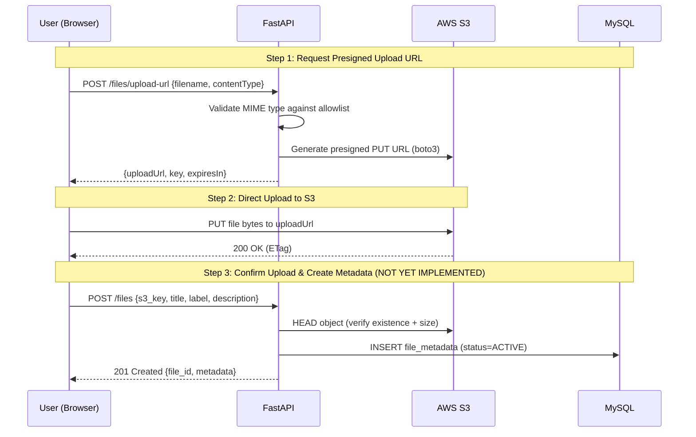
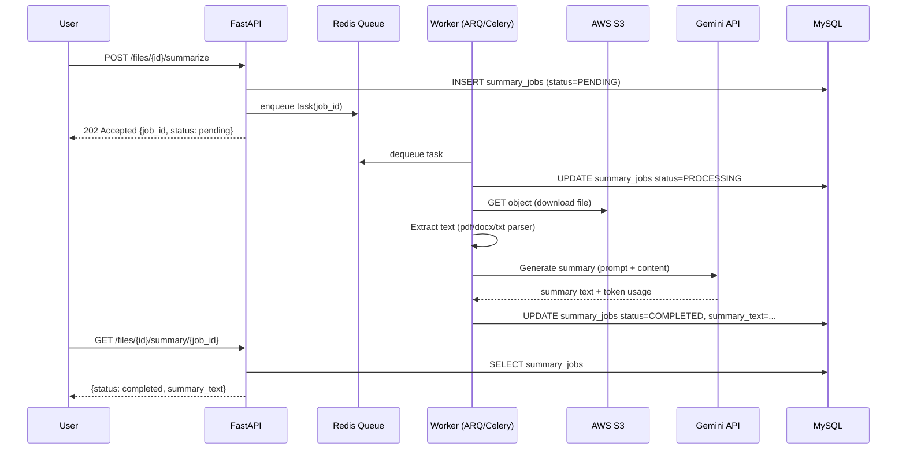
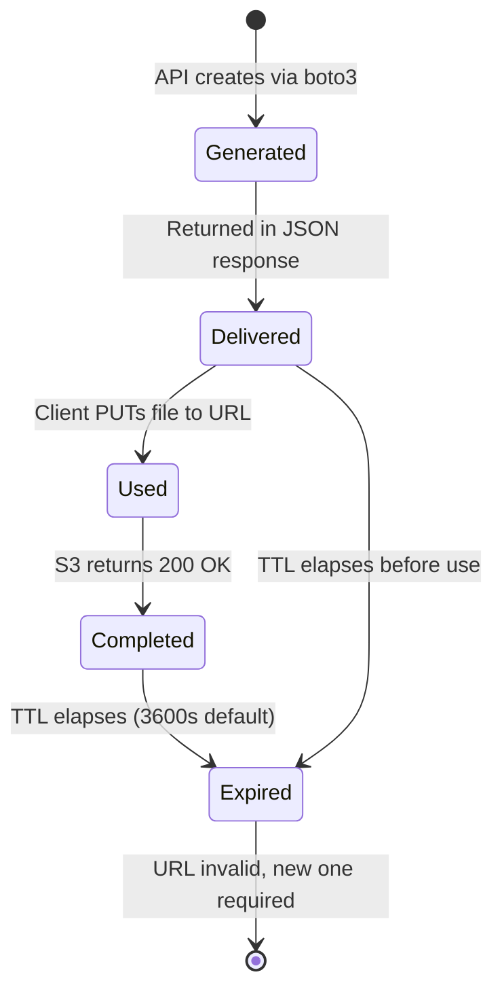

# Personal Knowledge Base — Phase 1 Technical Documentation

## 1. Project Plan & Objectives

### 1.1 Executive Summary

The Personal Knowledge Base (PKB) is a production-oriented backend system that enables authenticated users to upload files directly to AWS S3, manage rich metadata in MySQL, perform CRUD operations on that metadata, and generate AI-powered summaries using the Google Gemini API. The system is architected as a modular monolith with clear domain boundaries, designed to evolve through three major versions without requiring re-architecture of the core platform.

### 1.2 Version Roadmap

| Version | Scope | Core Technical Focus |
|---------|-------|---------------------|
| **V1** | File upload (direct-to-S3), metadata CRUD, AI summarization | Backend architecture, S3 presigned URLs, JWT auth, async LLM processing |
| **V2** | Semantic search via Qdrant, external connectors (Google Drive, GitHub) | Embeddings, chunking, vector search, adapter pattern for external sources |
| **V3** | Full RAG across all sources with conversational query interface | Multi-source retrieval, grounded generation, citation tracking |

### 1.3 V1 Definition of Done

A user can:
1. **Authenticate** via JWT-based login
2. **Request a presigned URL** for direct S3 upload
3. **Upload file directly** from browser to S3 (bypassing the API server)
4. **Confirm upload** and create metadata record in MySQL
5. **List, view, edit, and delete** file metadata
6. **Generate download URLs** for secure file retrieval
7. **Trigger AI summarization** — processed asynchronously, summary stored and retrievable

### 1.4 Core Architectural Principles

- **Direct-to-S3 Upload**: Files never transit through the FastAPI server. The API authorizes and issues a short-lived presigned URL; the client uploads directly to S3.
- **Separation of Concerns**: S3 stores binary blobs; MySQL stores metadata and application state; FastAPI orchestrates business logic.
- **Domain-Driven Modular Structure**: Each feature domain (auth, files, uploads, summarization) owns its router, schemas, models, services, and exceptions — avoiding the "layered" anti-pattern of global `models.py`/`schemas.py`/`routers/` directories.
- **Security by Default**: Private S3 bucket, short-lived presigned URLs, row-level ownership enforcement, encrypted secrets, parameterized queries.
- **Async-First**: Long-running operations (summarization, future embedding jobs) execute in background workers, not HTTP request threads.

---

## 2. Implementation Overview

### 2.1 Technology Stack (Current Implementation)

| Layer | Technology | Version |
|-------|------------|---------|
| **Framework** | FastAPI | 0.141.1 |
| **Language** | Python | 3.12+ |
| **Database** | MySQL | 8.0 (via PyMySQL) |
| **ORM** | SQLAlchemy | 2.0.52 (sync engine) |
| **Migrations** | Alembic | 1.19.1 |
| **Object Storage** | AWS S3 | via boto3 1.43.74 |
| **Authentication** | JWT (HS256) | python-jose 3.5.0 |
| **Password Hashing** | bcrypt | passlib 1.7.4 |
| **Validation** | Pydantic | 2.13.4 |
| **Configuration** | Pydantic Settings | 2.15.0 |
| **Server** | Uvicorn | 0.52.4 |

### 2.2 Project Structure (Actual vs. Planned)

The current implementation follows a **hybrid structure** — core cross-cutting concerns live in `app/core/`, `app/database/`, `app/auth/`, while feature domains are emerging under `app/apis/routes/` and `app/services/`.

```
backend/
├── app/
│   ├── auth/
│   │   └── auth.py              # JWT dependencies, user lookup
│   ├── core/
│   │   ├── config.py            # Pydantic Settings (AWS, S3, env loading)
│   │   └── security.py          # JWT creation/decoding, bcrypt hashing
│   ├── database/
│   │   ├── database.py          # SQLAlchemy engine, session factory, Base
│   │   └── db_models.py         # User ORM model
│   ├── schemas/
│   │   ├── schemas.py           # User, Token Pydantic models
│   │   └── file.py              # FileUploadRequest, PresignedUrlResponse
│   ├── services/
│   │   └── AWS/
│   │       └── s3_service.py    # Presigned URL generation, validation
│   ├── apis/
│   │   └── routes/
│   │       └── upload_file.py   # POST /files/upload-url endpoint
│   └── main.py                  # FastAPI app factory, router inclusion
├── alembic/                     # Migration environment
├── requirements.txt
└── .env (in ../others/)
```

**Note**: The planned structure (from project plan) advocates a stricter domain-driven layout (`src/files/`, `src/uploads/`, `src/summarization/`). The current codebase is an early V1 scaffold; future work should migrate toward the target structure.

### 2.3 Key Architectural Patterns in Use

#### 2.3.1 Dependency Injection (FastAPI Native)

FastAPI's `Depends()` system wires cross-cutting concerns:

```python
# app/database/database.py
def get_db():
    database = SessionLocal()
    try:
        yield database
    finally:
        database.close()

# app/auth/auth.py
async def get_current_user(
    token: str = Depends(oauth2_scheme),
    db: Session = Depends(get_db)
):
    ...
```

Routes declare dependencies; FastAPI resolves them per-request. This enables:
- **Testability**: Override dependencies in tests with fakes
- **Separation**: HTTP concerns (router) vs. business logic (service)
- **Reusability**: `get_current_user` protects any route that needs auth

#### 2.3.2 Service Layer Isolation

The `S3Service` (`app/services/AWS/s3_service.py`) encapsulates all AWS SDK logic:

```python
def create_presigned_put_url(filename: str, content_type: str) -> dict:
    # Validation, key generation, boto3 client creation, presigned URL generation
    ...
```

**Benefits**:
- Route handlers remain thin (~15 lines)
- S3 logic is unit-testable with `moto` mock
- Future storage adapters (Google Drive, GitHub) can implement the same interface
- Credentials and region config centralized in `Settings`

#### 2.3.3 Pydantic v2 for Validation & Serialization

All request/response boundaries use Pydantic models:

```python
# app/schemas/file.py
class FileUploadRequest(BaseModel):
    filename: str = Field(..., min_length=1, max_length=255)
    content_type: str = Field(..., alias="contentType")

class PresignedUrlResponse(BaseModel):
    upload_url: HttpUrl = Field(..., alias="uploadUrl")
    key: str
    expires_in: int
```

- **Aliases** (`contentType` ↔ `content_type`) enable camelCase JSON while keeping snake_case Python
- **HttpUrl** validates the presigned URL is well-formed
- **ConfigDict** with `populate_by_name=True` allows both alias and field name during construction

#### 2.3.4 Configuration via Pydantic Settings

```python
# app/core/config.py
class Settings(BaseSettings):
    model_config = SettingsConfigDict(env_file="../others/.env", extra="ignore")
    
    AWS_ACCESS_KEY_ID: str
    AWS_SECRET_ACCESS_KEY: str
    AWS_REGION: str = "ap-south-1"
    S3_BUCKET_NAME: str
    S3_PRESIGNED_URL_EXPIRY: int = 3600
```

- Type-safe, validated at startup
- `.env` file for local development (never committed)
- Production: inject via AWS Secrets Manager, SSM Parameter Store, or container env vars

---

## 3. System Workflow

### 3.1 Complete Upload Flow (Sequence Diagram)



### 3.2 Current Implemented Flow (Partial)

Only **Steps 1–2** are implemented in the current codebase:

1. **Client** → `POST /files/upload-url` with `{filename, contentType}`
2. **FastAPI** validates MIME type → calls `S3Service.create_presigned_put_url()`
3. **S3Service** generates unique key → calls `boto3.client.generate_presigned_url()`
4. **Response** → `{uploadUrl, key, expiresIn}` returned to client
5. **Client** → `PUT` file directly to S3 using the presigned URL

**Missing (planned for completion)**:
- `POST /files` to confirm upload and persist metadata
- `GET /files` listing with pagination/filtering
- `PATCH /files/{id}` for metadata updates
- `DELETE /files/{id}` for soft delete
- `POST /files/{id}/download-url` for presigned GET URLs

### 3.3 Summarization Flow (Planned for V1 Completion)



**Key Design Decision**: Asynchronous processing via a durable queue (Redis + ARQ recommended) rather than FastAPI's in-process `BackgroundTasks`. This ensures:
- Jobs survive server restarts
- Horizontal scaling of workers
- Retry/dead-letter handling
- Observability (job status, duration, token usage)

---

## 4. Deep Dive: Presigned URLs

### 4.1 What Is a Presigned URL?

A **presigned URL** is a cryptographically signed URL that grants temporary, limited permission to perform a specific S3 operation (e.g., `PUT` an object, `GET` an object) without requiring the caller to possess AWS credentials.

**Analogy**: Think of it as a **single-use, time-limited key** to a specific locker in a warehouse. The warehouse (S3) doesn't need to know who you are — it only verifies the key's signature and checks that it hasn't expired.

### 4.2 Security Rationale

| Threat | Mitigation via Presigned URLs |
|--------|------------------------------|
| **Credential leakage** | Client never sees AWS access keys; only receives a signed URL |
| **Unbounded access** | URL scoped to **one HTTP method**, **one object key**, **one bucket** |
| **Long-term exposure** | Short TTL (default 1 hour, configurable; 5–15 min recommended for uploads) |
| **Bucket enumeration** | No `ListBucket` permission granted; client can't discover other objects |
| **Privilege escalation** | Signature binds to specific `Content-Type` and `Content-Length` (if using POST policy) |
| **Replay attacks** | URL expires; cannot be reused after `ExpiresIn` seconds |

**Why Not Proxy Through FastAPI?**
```
❌ Browser → FastAPI (stream bytes) → S3
✅ Browser → FastAPI (auth only) → Browser → S3 (direct bytes)
```
- **Memory/CPU**: Large files don't pressure API server
- **Bandwidth**: No double-hop through your infrastructure
- **Scalability**: S3 handles millions of concurrent uploads; your API handles auth only
- **Latency**: Client uploads to nearest S3 edge; no added hop

### 4.3 Presigned URL Lifecycle



**Critical Timing**: The `ExpiresIn` parameter (seconds) starts counting from **generation time**, not first use. A URL generated at T=0 with `ExpiresIn=3600` is invalid after T=3600 regardless of whether the client used it.

### 4.4 Implementation Details (Code Walkthrough)

#### 4.4.1 Request Schema (`app/schemas/file.py:10-15`)

```python
class FileUploadRequest(BaseModel):
    model_config = ConfigDict(populate_by_name=True)

    filename: str = Field(..., min_length=1, max_length=255)
    content_type: str = Field(..., alias="contentType")
```

- **`filename`**: Original name from client; length-bounded to prevent abuse
- **`content_type`**: MIME type (e.g., `application/pdf`); validated server-side against allowlist
- **`alias="contentType"`**: Accepts camelCase JSON (`{"contentType": "..."}`) while Python uses snake_case

#### 4.4.2 Route Handler (`app/apis/routes/upload_file.py:14-33`)

```python
@router.post("/upload-url", response_model=PresignedUrlResponse)
async def get_upload_url(payload: FileUploadRequest):
    try:
        result = create_presigned_put_url(
            filename=payload.filename,
            content_type=payload.content_type,
        )
    except ValueError as exc:
        raise HTTPException(status_code=400, detail=str(exc))
    except RuntimeError as exc:
        raise HTTPException(status_code=500, detail="Failed to generate upload URL.")

    return PresignedUrlResponse(**result)
```

- **Thin controller**: Delegates to service, maps exceptions to HTTP status codes
- **`ValueError` → 400**: Client error (invalid MIME type)
- **`RuntimeError` → 500**: Server error (AWS SDK failure, network, credentials)
- **Response model**: Ensures output conforms to `PresignedUrlResponse` schema

#### 4.4.3 Service Layer (`app/services/AWS/s3_service.py:17-76`)

**A. MIME Type Allowlist (Lines 17–22)**

```python
ALLOWED_MIME_TYPES = {
    "application/pdf",
    "application/vnd.openxmlformats-officedocument.wordprocessingml.document",
    "text/plain",
    "text/markdown",
}
```

- **Whitelist approach**: Only explicitly allowed types pass; denies by default
- **Extensible**: Add types as extraction support is implemented
- **Client cannot bypass**: Validation happens server-side before URL generation

**B. Filename Sanitization (Lines 25–30)**

```python
def _sanitize_filename(filename: str) -> str:
    filename = os.path.basename(filename)      # Strip path traversal (../)
    filename = unquote(filename)               # Decode URL-encoded chars
    filename = re.sub(r"[^a-zA-Z0-9_.-]", "_", filename)  # Replace unsafe chars
    return filename.strip("._") or "file"      # Fallback if empty
```

- **Path traversal prevention**: `os.path.basename()` removes directory components
- **Unicode/encoding safety**: `unquote()` handles `%20`, `%2F`, etc.
- **Character allowlist**: Only alphanumerics, underscore, dot, hyphen preserved
- **Empty fallback**: Returns `"file"` if sanitization yields empty string

**C. Unique Object Key Generation (Lines 33–37)**

```python
def generate_safe_key(filename: str) -> str:
    safe_name = _sanitize_filename(filename)
    unique_id = uuid.uuid4().hex
    return f"uploads/{unique_id}_{safe_name}"
```

- **UUIDv4 (hex)**: 32-character cryptographically random string — prevents key collision and enumeration
- **Prefix `uploads/`**: Logical grouping for lifecycle policies, monitoring
- **Original name preserved**: Appended after UUID for human readability in S3 console
- **No user ID in key (current)**: Planned enhancement — `users/{user_id}/uploads/{uuid}_{name}` for multi-tenancy isolation

**D. Presigned URL Generation (Lines 45–76)**

```python
def create_presigned_put_url(filename: str, content_type: str) -> dict:
    if not validate_mime_type(content_type):
        raise ValueError(f"Unsupported file type: {content_type}")

    key = generate_safe_key(filename)

    s3_client = boto3.client(
        "s3",
        region_name=settings.AWS_REGION,
        aws_access_key_id=settings.AWS_ACCESS_KEY_ID,
        aws_secret_access_key=settings.AWS_SECRET_ACCESS_KEY,
    )

    try:
        response = s3_client.generate_presigned_url(
            ClientMethod="put_object",
            Params={
                "Bucket": settings.S3_BUCKET_NAME,
                "Key": key,
                "ContentType": content_type,
            },
            ExpiresIn=settings.S3_PRESIGNED_URL_EXPIRY,
        )
    except (ClientError, BotoCoreError) as exc:
        raise RuntimeError("Failed to generate presigned URL.") from exc

    return {
        "upload_url": response,
        "key": key,
        "expires_in": settings.S3_PRESIGNED_URL_EXPIRY,
    }
```

**Parameter Breakdown**:

| Parameter | Value | Purpose |
|-----------|-------|---------|
| `ClientMethod` | `"put_object"` | Allows HTTP PUT to upload an object |
| `Params.Bucket` | `settings.S3_BUCKET_NAME` | Target bucket (from config) |
| `Params.Key` | `key` | Unique object key (UUID + sanitized filename) |
| `Params.ContentType` | `content_type` | **Enforces MIME type** — client must send matching `Content-Type` header or S3 rejects |
| `ExpiresIn` | `settings.S3_PRESIGNED_URL_EXPIRY` (default 3600s) | URL validity window |

**Security Properties of This Call**:
1. **Method binding**: Only `PUT` allowed; `GET`, `DELETE`, `POST` fail
2. **Key binding**: Only this exact object key; cannot upload to different path
3. **Content-Type binding**: Client must declare the same MIME type; mismatch → 403
4. **Bucket binding**: Cannot redirect to different bucket
5. **Time binding**: Signature expires after `ExpiresIn` seconds

**Error Handling**:
- `ValueError` for validation failures (client fixable)
- `RuntimeError` wrapping `ClientError`/`BotoCoreError` for AWS failures (server side)
- **No credential leakage**: Exceptions don't expose keys, signatures, or internal AWS errors

#### 4.4.4 Response Schema (`app/schemas/file.py:16-21`)

```python
class PresignedUrlResponse(BaseModel):
    model_config = ConfigDict(populate_by_name=True)

    upload_url: HttpUrl = Field(..., alias="uploadUrl")
    key: str
    expires_in: int
```

- **`HttpUrl`**: Pydantic validates the URL is syntactically correct
- **`key`**: Client must include this in subsequent `POST /files` to link metadata
- **`expires_in`**: Client can show countdown or auto-refresh before expiry

### 4.5 Client-Side Usage Example

```javascript
// 1. Request presigned URL
const response = await fetch('/api/v1/files/upload-url', {
  method: 'POST',
  headers: {
    'Content-Type': 'application/json',
    'Authorization': `Bearer ${accessToken}`
  },
  body: JSON.stringify({
    filename: 'document.pdf',
    contentType: 'application/pdf'
  })
});

const { uploadUrl, key, expiresIn } = await response.json();

// 2. Upload directly to S3
const file = fileInput.files[0];
await fetch(uploadUrl, {
  method: 'PUT',
  headers: {
    'Content-Type': file.type  // Must match contentType from step 1
  },
  body: file
});

// 3. Confirm upload (future endpoint)
await fetch('/api/v1/files', {
  method: 'POST',
  headers: { 'Content-Type': 'application/json', 'Authorization': `Bearer ${accessToken}` },
  body: JSON.stringify({
    s3_key: key,
    title: 'My Document',
    label: 'work',
    description: 'Q3 budget proposal'
  })
});
```

### 4.6 S3 Bucket Configuration Requirements

For this architecture to work securely, the S3 bucket must be configured as follows:

| Setting | Value | Rationale |
|---------|-------|-----------|
| **Block Public Access** | **ON (all four settings)** | Prevents accidental public exposure |
| **Bucket Policy** | Deny all principals except your IAM role | Defense in depth |
| **Server-Side Encryption** | SSE-S3 or SSE-KMS (default) | Encrypts data at rest |
| **Versioning** | **Enabled** | Protects against accidental overwrite; enables recovery |
| **CORS Configuration** | Allow `PUT` from your frontend origin only | Browser enforces CORS on presigned PUT |
| **Lifecycle Rules** | Transition to Glacier after 90d; expire incomplete multipart uploads after 7d | Cost optimization |

**Example CORS Configuration**:
```json
[
  {
    "AllowedHeaders": ["*"],
    "AllowedMethods": ["PUT", "GET", "HEAD"],
    "AllowedOrigins": ["https://your-frontend-domain.com"],
    "ExposeHeaders": ["ETag"],
    "MaxAgeSeconds": 3600
  }
]
```

### 4.7 Current Limitations & Planned Enhancements

| Limitation | Planned Fix |
|------------|-------------|
| No file size validation | Add `file_size` to request; enforce via S3 POST policy `Content-Length-Range` or Lambda@Edge |
| No user ID in object key | Prefix with `users/{user_id}/` for tenancy isolation |
| No upload verification step | Implement `POST /files` with `HEAD` check before DB insert |
| Single expiry for all files | Shorten to 5 min (300s) for uploads; longer for downloads |
| No multipart upload support | For >100MB files, generate presigned POST policy with multipart parts |
| No malware scanning | Integrate ClamAV or AWS Lambda scanner on `s3:ObjectCreated:*` event |

### 4.8 Why This Design Scales

| Scale Challenge | How Presigned URLs Handle It |
|-----------------|------------------------------|
| **10K concurrent uploads** | S3 handles natively; API only issues 10K short URLs (cheap, stateless) |
| **Large files (GBs)** | Client streams directly to S3; no API memory/buffer pressure |
| **Global users** | S3 Transfer Acceleration or CloudFront edge locations; URL works from anywhere |
| **Cost control** | No egress through your servers; pay only S3 request + storage costs |
| **Reliability** | S3 99.99% availability; retries handled by client SDK/browser |

---

## 5. Conclusion

Phase 1 establishes the **foundational backbone** of the Personal Knowledge Base: secure, direct-to-S3 file ingestion with JWT-authenticated access control and a clean service-layer abstraction for storage operations. The presigned URL mechanism is the linchpin — it decouples upload throughput from API capacity, enforces least-privilege access, and sets the stage for all future features (metadata CRUD, summarization, semantic search, RAG) to build on a consistent, scalable storage contract.

**Next Implementation Priorities**:
1. `POST /files` — confirm upload, verify S3 object, persist metadata
2. File CRUD endpoints (list, get, patch, delete) with ownership enforcement
3. `POST /files/{id}/download-url` — presigned GET URLs
4. Async summarization pipeline (worker + queue + Gemini integration)
5. Migration to domain-driven folder structure per project plan

This documentation should serve as both a technical reference for the current implementation and a blueprint for the remaining V1 work.