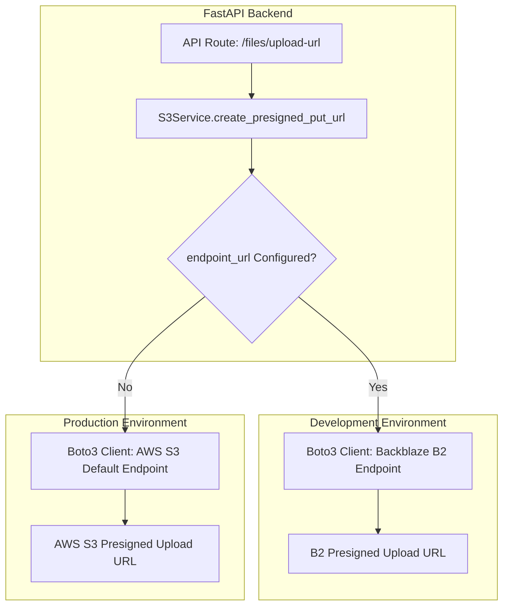

# Personal Knowledge Base — Phase 2: Multi-Provider S3 Storage Integration

This document outlines the architecture, configuration, and implementation guidelines for supporting multi-provider S3-compatible storage. The PKB uses **Backblaze B2** for development and testing, and **AWS S3** for production deployment.

---

## 1. Architectural Overview

Since Backblaze B2 exposes an S3-compatible API, we can leverage the existing `boto3` client implementation without modifying the core business logic. The primary architectural change involves introducing an optional custom endpoint URL configuration parameter to direct the `boto3` client to Backblaze B2 endpoints during development.



---

## 2. Configuration Parameters

The application uses Pydantic Settings in [config.py](file:///d:/Personal_Knowledge_Base/backend/app/core/config.py) to parse environment variables from the [.env](file:///d:/Personal_Knowledge_Base/others/.env) file. 

To support Backblaze B2, the settings schema is extended with an optional `AWS_ENDPOINT_URL` property.

### 2.1 Settings Schema Change Blueprint

Here is the required modification to the `Settings` class in [config.py](file:///d:/Personal_Knowledge_Base/backend/app/core/config.py):

```python
class Settings(BaseSettings):
    model_config = SettingsConfigDict(env_file="../others/.env", extra="ignore")

    AWS_ACCESS_KEY_ID: str
    AWS_SECRET_ACCESS_KEY: str
    AWS_REGION: str = "ap-south-1"
    AWS_ENDPOINT_URL: str | None = None  # <-- Configures custom S3-compatible endpoint (e.g. Backblaze B2)
    S3_BUCKET_NAME: str
    S3_PRESIGNED_URL_EXPIRY: int = 3600
```

### 2.2 Environment Configurations

Depending on the environment, populate [.env](file:///d:/Personal_Knowledge_Base/others/.env) with the following values:

| Variable | Description | Development (Backblaze B2) | Production (AWS S3) |
|---|---|---|---|
| `AWS_ACCESS_KEY_ID` | Access key credentials | Backblaze Application Key ID | AWS Access Key ID |
| `AWS_SECRET_ACCESS_KEY` | Secret access credentials | Backblaze Application Key | AWS Secret Access Key |
| `AWS_REGION` | Storage hosting region | e.g., `us-west-004` | e.g., `ap-south-1` |
| `AWS_ENDPOINT_URL` | S3 API endpoint URL | `https://s3.us-west-004.backblazeb2.com` | *Omit or leave blank* |
| `S3_BUCKET_NAME` | Storage bucket name | Name of B2 Bucket | Name of S3 Bucket |
| `S3_PRESIGNED_URL_EXPIRY` | Presigned URL expiration (sec) | `3600` | `3600` |

---

## 3. Storage Service Implementation

The `S3Service` class in [s3_service.py](file:///d:/Personal_Knowledge_Base/backend/app/services/AWS/s3_service.py) initializes the `boto3` S3 client using the parameters loaded from the configuration settings.

### 3.1 Code Implementation Blueprint

Modify the client initialization inside `create_presigned_put_url` to pass the `endpoint_url` parameter conditionally:

```python
def create_presigned_put_url(filename: str, content_type: str) -> dict:
    if not validate_mime_type(content_type):
        raise ValueError(f"Unsupported file type: {content_type}")

    key = generate_safe_key(filename)

    # Initialize S3 client with optional endpoint_url parameter
    s3_client = boto3.client(
        "s3",
        region_name=settings.AWS_REGION,
        aws_access_key_id=settings.AWS_ACCESS_KEY_ID,
        aws_secret_access_key=settings.AWS_SECRET_ACCESS_KEY,
        endpoint_url=settings.AWS_ENDPOINT_URL,  # <-- Dynamic endpoint routing
    )

    try:
        response = s3_client.generate_presigned_url(
            ClientMethod="put_object",
            Params={
                "Bucket": settings.S3_BUCKET_NAME,
                "Key": key,
                "ContentType": content_type,
            },
            ExpiresIn=settings.S3_PRESIGNED_URL_EXPIRY,
        )
    except (ClientError, BotoCoreError) as exc:
        raise RuntimeError("Failed to generate presigned URL.") from exc

    return {
        "upload_url": response,
        "key": key,
        "expires_in": settings.S3_PRESIGNED_URL_EXPIRY,
    }
```

*Note: If `settings.AWS_ENDPOINT_URL` is `None` (empty or missing in environment configs), `boto3` defaults to native AWS endpoints automatically.*

---

## 4. Bucket CORS & Permissions Configuration

Because files are uploaded directly from the browser/client-side using presigned URLs, CORS rules must be configured properly on both storage providers to prevent browsers from blocking the `PUT` requests.

### 4.1 Backblaze B2 CORS Settings (Dev/Test)

Backblaze B2 CORS rules can be configured via the Backblaze Web Console (under **Buckets** -> **Bucket Settings** -> **CORS Rules**) or using the B2 CLI tool. 

Example configuration:
- **Allowed Origins**: `http://localhost:5173` (or your frontend origin)
- **Allowed Operations**: `s3_put`, `s3_get`, `s3_head`
- **Allowed Headers**: `*`
- **Expose Headers**: `ETag`
- **Max Age**: `3600`

### 4.2 AWS S3 CORS Policy (Production)

AWS S3 CORS rules are configured in the AWS S3 Console under **Permissions** -> **Cross-origin resource sharing (CORS)** in JSON format:

```json
[
  {
    "AllowedHeaders": ["*"],
    "AllowedMethods": ["PUT", "GET", "HEAD"],
    "AllowedOrigins": ["https://your-production-app.com"],
    "ExposeHeaders": ["ETag"],
    "MaxAgeSeconds": 3600
  }
]
```

---

## 5. Verification & Testing Workflow

To verify that the multi-provider integration works correctly in both environments:

1. **Backend Endpoint Verification**:
   Send a request to the FastAPI endpoint to generate a presigned URL.
   ```bash
   curl -X POST "http://localhost:8000/api/v1/files/upload-url" \
     -H "Content-Type: application/json" \
     -d '{"filename": "test.txt", "contentType": "text/plain"}'
   ```
   Check the response `upload_url`. For Dev/Test, it should point to `*.backblazeb2.com`. For Production, it should point to `*.amazonaws.com`.

2. **Upload Execution**:
   Upload a test text file using the generated presigned URL:
   ```bash
   curl -X PUT "<GENERATED_UPLOAD_URL>" \
     -H "Content-Type: text/plain" \
     -d "Hello, S3 Storage Provider Verification!"
   ```
   The response must return a `200 OK` status code.
