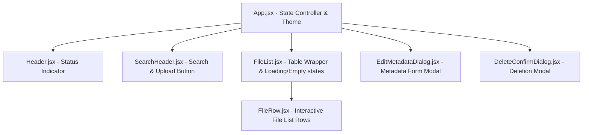

# Phase 5 Technical Documentation: Frontend Architecture Refactoring, Input Validation & Native View Handlers

Welcome to the technical documentation for **Phase 5** of the **Personal Knowledge Base** system. 

In this phase, we transitioned the frontend codebase from a monolithic file into a clean, modular component architecture. We also enforced strict input validation rules, integrated character counters with warning states, and implemented native browser previews for Word `.docx` documents.

If you are a student or junior developer, this document will help you understand React component decomposition, the "Lifting State Up" design pattern, and standard practices for client-side form validation.

---

## 1. Architectural Overview: Monolith vs. Modular

In software engineering, a **monolith** is a single, large file or system containing code for multiple different features. In the previous phase, `App.jsx` was a monolith of over 1,300 lines of code handling:
1. API network calls (`documentApi`, `systemApi`)
2. React State management (selected files, upload progress, documents lists)
3. Lifecycle hooks (`useEffect` for mounting and pings)
4. Layout structures (Header, search inputs, grid lists)
5. Visual Modals (edit details form, delete verification prompts)

### The Problem with Monolithic UIs
As a project grows, monolithic files become difficult to maintain, prone to merge conflicts, and challenging to debug. If a developer wants to update the Upload button, they risk accidentally breaking code in the Edit dialog.

### The Solution: Modular Design & "Lifting State Up"
To solve this, we refactored `App.jsx` by splitting it into single-responsibility presentational components inside the `src/components/` folder.

#### Component Import Structure


### Educational Concept: Lifting State Up
In React, data flows in one direction: **downward** from parents to children via `props`. When multiple child components need to share the same state (e.g. `SearchHeader` triggers an upload that adds a file, which `FileList` needs to show), that state must live in their closest common parent.

* **Orchestrator (`App.jsx`)**: Acts as the single source of truth. It manages the React state (like the `documents` array and `uploading` boolean) and declares the API call handlers.
* **Presentational Components (under `src/components/`)**: Are "dumb" or functional components. They do not maintain S3 or database connections. Instead, they receive values and action callbacks (like `onOpen`, `onEdit`, `onDelete`) as props, keeping them highly reusable.

---

## 2. Directory Layout & Component Breakdown

Here is a description of the newly created component files located in the `src/components/` folder:

### 1. Header (`Header.jsx`)
* **Purpose**: Renders the top navigation header and shows the server connectivity state.
* **Key Feature**: A connection status dot which color-codes the API's status:
  * Green (`online`): FastAPI backend is active and reachable.
  * Red (`offline`): Server is unreachable.
  * Yellow (`checking`): A pulsing dot representing connection setup or checks.

### 2. SearchHeader (`SearchHeader.jsx`)
* **Purpose**: Wraps the semantic search bar input field and the file upload trigger button.
* **Key Design Choice**: Removed large drag-and-drop square regions. It renders a clean, compact **Upload File** button next to the search input.
* **File Selection Banner**: If a file is selected, a banner slides in showing the file details, an upload progress bar, and a green **Confirm Upload** action.

### 3. FileList (`FileList.jsx`)
* **Purpose**: Renders the core table grid container. 
* **Fixed Column Widths**: Employs `tableLayout: 'fixed'` and explicit cell percentages (`width: '32%'` for title, `width: '48%'` for description, and `width: '130px'` for actions) to guarantee that long content never breaks the grid layout.
* **Skeleton Loaders**: Renders animated MUI `<Skeleton />` rows when files are loading from the database (`loadingDocs` is true).
* **Empty State**: Renders an illustrative folder icon and custom text if no files are found or match the search.

### 4. FileRow (`FileRow.jsx`)
* **Purpose**: Renders an individual row (`TableRow`) inside the list table.
* **Traditional File Icons**: Maps file extensions to standard Material UI icons:
  * **PDF**: Red `PictureAsPdf` icon.
  * **Word/DOCX**: Blue `Description` icon.
  * **Markdown/MD**: Sky Blue `Code` icon.
  * **Text/TXT**: Green `TextSnippet` icon.
  * **Default/Fallback**: Gray `InsertDriveFile` icon.
* **Fixed Row Height**: The row height is set to `72px` and `verticalAlign: 'middle'` to prevent varying text sizes from shifting heights.
* **Single-Row Tag Chips**: Tag chips are wrapped inside a non-wrapping, scroll-hidden container (`flexWrap: 'nowrap'`, `overflowX: 'auto'`). This guarantees tags will never overflow onto a second line, maintaining row height consistency.

### 5. EditMetadataDialog (`EditMetadataDialog.jsx`)
* **Purpose**: Renders the dialog modal form for editing document metadata (Title, Description, and Tags).
* **Validation Elements**: Incorporates character counters, state-slicing logic, and disabled buttons when limits are breached.

### 6. DeleteConfirmDialog (`DeleteConfirmDialog.jsx`)
* **Purpose**: Safeguards against accidental file deletions.
* **UI Style**: Displays a high-contrast red warning dialog with warning indicators. Disables buttons while deletion is in progress.

---

## 3. MUI Light-Mode Design System & Theme

To ensure a futuristic, high-contrast presentation, we deprecated the dark/light mode toggle switch and standardized the app layout using a unified Light Mode theme.

### Color Palette Tokens
We configured the MUI `createTheme` engine in `App.jsx` using these exact tokens:

| Palette Key | Token Color | HEX Code | UI Role |
| :--- | :--- | :--- | :--- |
| **Canvas Background** | Slate Off-White | `#F8FAFC` | Main application canvas backdrop |
| **Surface/Paper** | Pure White | `#FFFFFF` | File tables, form dialogs, and headers |
| **Primary Text** | Deep Slate/Coal | `#0F172A` | Standard titles and paragraphs |
| **Secondary Text** | Slate Gray | `#64748B` | Helper captions, counters, and file sizes |
| **Primary Accent** | Deep Navy Blue | `#0A192F` | Action buttons and theme primary accents |
| **Divider** | Light Slate | `#E2E8F0` | Table cell dividers and boundaries |

---

## 4. Strict Input Validation & Multi-Tier Guards

To protect the MySQL metadata database from column overflow errors, we implemented a **three-tier validation system** on document metadata inputs.

### The Validation Rules
* **Title**: Maximum 100 characters.
* **Tags (Individual tag name)**: Maximum 50 characters.
* **Tags (Combined joined string)**: Maximum 100 characters (including commas).
* **Description**: Maximum 255 characters.

### Multi-Tier Safeguard Workflow
Our validation guards inputs at every stage of interaction:

```text
User Input/Paste → 1. Keyboard block (maxLength) → 2. State-level Clamping (.slice) → 3. Pre-Flight Save Check
```

1. **Keyboard Block (HTML Level)**: Text fields use standard input properties `inputProps={{ maxLength: N }}` to block the keyboard from typing past the limits.
2. **State-Level Clamping (React State)**: If a user bypasses HTML input controls by pasting a long block of text, the text is sliced instantly in the state setter callback:
   ```javascript
   onChange={(e) => setEditTitle(e.target.value.slice(0, 100))}
   ```
3. **Pre-Flight Save Check (API Layer)**: Before transmitting payloads to the network, the handler `handleSaveMetadata` runs final length assertions. If validation fails, execution aborts and a high-contrast validation alert is outputted, keeping the database protected.

### Dynamic Character Counters & Warning States
Under each input, a helper counter displays the character usage (e.g. `85/100`). The counter's text color changes dynamically based on the space occupied:
* **Muted Gray (`text.secondary`)**: Normal usage (under 80% capacity).
* **Warning Orange (`warning.main`)**: High usage (between 80% and 99% capacity).
* **Error Red (`error.main`)**: Limit reached (100% capacity).

---

## 5. Client-Side Search Bar Mechanism

The search functionality filters files purely on the client side, resulting in instantaneous, latency-free results.

### The Filtering Logic
The search keyword is checked case-insensitively against four different fields in the document metadata: `title`, `filename`, `description`, and `tags`.

```javascript
// Located inside src/components/FileList.jsx
const filteredDocs = documents.filter((doc) => {
  if (!searchTerm.trim()) return true // Show all if search box is empty
  const term = searchTerm.toLowerCase()
  
  const titleMatch = doc.title?.toLowerCase().includes(term)
  const filenameMatch = doc.filename?.toLowerCase().includes(term)
  const descMatch = doc.description?.toLowerCase().includes(term)
  const tagMatch = doc.tags?.toLowerCase().includes(term)
  
  return titleMatch || filenameMatch || descMatch || tagMatch
})
```

---

## 6. Native Browser Document Viewing (`.docx`)

### The Challenge with Word Files
Browsers do not have a native viewer engine for Microsoft Word `.docx` documents (unlike `.pdf` or `.txt`). When the browser navigates directly to a pre-signed S3 download URL for a `.docx` file, it forces the file to download locally.

### The Office Web Viewer Integration
To resolve this, we configured `handleViewFile` in `App.jsx` to intercept Word documents. If the target file is a `.docx` file, we prefix the pre-signed S3 URL with Microsoft's native Office Web Viewer service:

```javascript
const isDocx = targetKey.toLowerCase().endsWith('.docx') || targetKey.toLowerCase().includes('.docx')
const openUrl = isDocx
  ? `https://view.officeapps.live.com/op/view.aspx?src=${encodeURIComponent(viewUrl)}`
  : viewUrl
window.open(openUrl, '_blank')
```

When clicked, the browser opens Microsoft's native Office viewer in a new tab, loading the file from S3 and rendering it as a native preview without downloading it locally.

---

## 7. Implementation Checklist

| Area | Component / Feature | Implementation Status |
| :--- | :--- | :--- |
| **Theme System** | Dedicated High-Contrast Light Mode | Active & Standardized |
| **Modular Views** | Presentational Components (`src/components/`) | Completed & Refactored |
| **File List Layout** | Fixed heights (`72px`) & `tableLayout: 'fixed'` | Active & Implemented |
| **Input Limits** | HTML `maxLength` & React state-slicing | Active & Enforced |
| **UX Warning States** | Dynamic text color transitions (Muted $\rightarrow$ Orange $\rightarrow$ Red) | Active & Implemented |
| **Search Filter** | Client-side keyword substring matching | Active & Implemented |
| **DOCX View Handler** | Office Web Viewer URL redirection | Active & Implemented |
