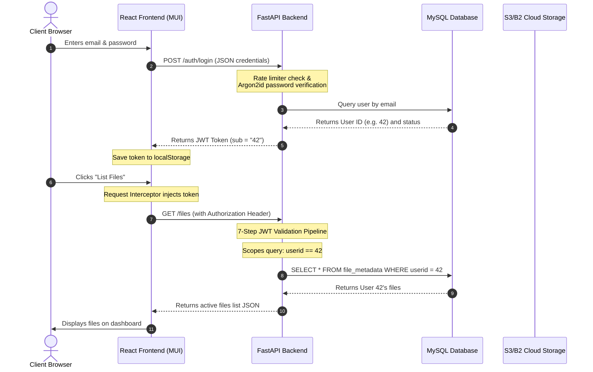

# Phase 6 Technical Documentation: Stateless JWT Authentication, MySQL Database Upgrade & Multi-Tenant File Isolation

Welcome to the technical documentation for **Phase 6** of the **Personal Knowledge Base** system. 

In this phase, we transitioned the application from a single-user prototype to a secure, production-oriented, multi-user system. We upgraded the MySQL database schema, migrated legacy test data safely, implemented Argon2id password hashing, established a 7-step JWT validation pipeline, built a minimalist React Material-UI (MUI) authentication page, and enforced strict multi-tenant file isolation.

---

## 1. Architectural Overview: How Multi-User Security Works

To support multiple users safely, the application must verify **who you are** (Authentication) and ensure **you only access what you own** (Authorization). 

The request flow below illustrates how a user logs in, receives a token, and makes authenticated, isolated file requests:



---

## 2. Database Design & Safe Schema Upgrades

### MySQL Schema Evolution
Relational databases enforce constraints to maintain data integrity. We refactored two main database tables defined in [db_models.py](file:///d:/Personal_Knowledge_Base/backend/app/database/db_models.py):

#### 1. `users` Table Upgrades
- **Removed `username`**: Modern apps prefer using `email` directly as the unique login identity to reduce input friction.
- **`email` (VARCHAR(255))**: Expanded from 100 characters to prevent truncation of long valid email addresses.
- **`hashed_password` (VARCHAR(255))**: Expanded from 100 characters because modern password-hashing algorithms (like Argon2id) produce longer, salt-enriched strings.
- **Metadata Fields**: Added `status` (for account state control) and `created_at` timestamps.

#### 2. `file_metadata` Table Upgrades
- **`userid` (INT, NOT NULL)**: Upgraded from an optional (`nullable=True`) column to a mandatory (`nullable=False`) foreign key with a `CASCADE` delete constraint. This ensures that every file belongs to a valid user, and if a user account is deleted, all their file records are automatically cleaned up.
- **Field Normalization**: Reduced column widths (`title` -> 100, `description` -> 255, `tags` -> 50) to align database limits with frontend character counters, preventing column overflow errors.

---

### Staged Database Migration Strategy (Alembic)
When modifying a column to `NOT NULL` on a pre-populated database, the migration will crash if any existing rows contain `NULL` values. In production, this requires a staged approach.

Our migration script located in [ce06d2ee9755_phase6_jwt_and_mysql_upgrade.py](file:///d:/Personal_Knowledge_Base/backend/alembic/versions/ce06d2ee9755_phase6_jwt_and_mysql_upgrade.py) handles this safely with minimal downtime:

1. **Purge Or Clean Legacy Test Data**: 
   ```python
   # Deletes unowned files uploaded during prototype development
   op.execute("DELETE FROM file_metadata WHERE userid IS NULL;")
   ```
2. **Resolve Constraints**: MySQL prevents making a column `NOT NULL` if it is currently target to a foreign key constraint set to `ON DELETE SET NULL`. The script drops the old foreign key constraint, modifies the column to `NOT NULL`, and then applies the new `ON DELETE CASCADE` foreign key.

---

## 3. Backend Security & JWT Authentication

### Argon2id Password Hashing
Rather than using older algorithms like MD5, SHA-256, or bcrypt, we implemented **Argon2id** (configured in [security.py](file:///d:/Personal_Knowledge_Base/backend/app/core/security.py)):

> [!NOTE]
> **Educational Concept: Why Argon2id?**
> Argon2id is the winner of the Password Hashing Competition (PHC). It is memory-hard and time-hard, meaning it requires configurable amounts of RAM and execution time to compute. This makes it highly resistant to modern brute-force attacks running on specialized parallel hardware (like GPUs or ASICs).

---

### Stateless Sessions & JWT Design
Traditional web applications store session details in server-side memory (stateful sessions). Instead, we use **JSON Web Tokens (JWT)**:

> [!TIP]
> **Educational Concept: The Movie Ticket Analogy**
> A stateful session is like checking in at a hotel lobby; the receptionist remembers you. A stateless JWT is like a stamped movie ticket. The cinema (server) doesn't keep a folder with your name on it; it simply inspects the signature of the ticket you present. If the signature is genuine and the time hasn't expired, you are allowed in.

- **Access Token Expiry**: Short-lived (30 minutes) to minimize exposure window if a token is intercepted.
- **Subject Claim (`sub`)**: Encodes the user's integer database ID (`"sub": "12"`) rather than the email address, separating user identity from personal information (PII) inside the token.

---

### 7-Step JWT Validation Pipeline
Every protected route runs through a strict dependency pipeline in [auth.py](file:///d:/Personal_Knowledge_Base/backend/app/auth/auth.py):

```text
Step 1: Check Authorization header -> Extract Bearer token string (or return 401)
Step 2: Verify signature using SECRET_KEY & HS256 algorithm (or return 401)
Step 3: Verify token exp claim -> Confirm token has not expired (or return 401)
Step 4: Check 'sub' claim exists in payload (or return 401)
Step 5: Convert 'sub' string to integer user_id (or return 401)
Step 6: Query database for User matching user_id -> Confirm user exists (or return 401)
Step 7: Check user.status == "active" -> Confirm account is not disabled (or return 403)
```

---

### Basic Single-Instance Rate Limiting
To prevent automated brute-force password guessing, we implemented an in-memory sliding-window failed-attempt tracker:
- **Rule**: Max 5 failed login attempts per 15 minutes per IP/Email.
- **Storage**: Tracked in a python dictionary at runtime. If a user logs in successfully, their failure history is cleared.
- *Production Note*: This is a simple single-instance rate limiter. If the app is scaled horizontally across multiple servers, a centralized memory store (like Redis) would be used.

---

## 4. Frontend Architecture & MUI Authentication UI

### Separation of Concerns
To keep the React client clean and modular, we decoupled presentational UI from data fetching and local session storage:

```text
React Pages/Components             API Layer (Axios)             Service Layer (Storage)
┌───────────────────────┐         ┌───────────────────┐         ┌─────────────────────┐
│ AuthPage.jsx (Forms)  │ ──────> │ authApi.js        │         │ authService.js      │
│ Header.jsx (Menu)     │         │ axiosClient.js    │ ──────> │ (LocalStorage keys) │
│ App.jsx (Orchestrator)│         └───────────────────┘         └─────────────────────┘
└───────────────────────┘
```

1. **`authService.js` (NEW)**: Manages local storage token retrieval, token eviction, and manual token parsing (extracting `sub` and `exp` from base64 JWT payload).
2. **`authApi.js` (NEW)**: Contains pure network functions executing Axios calls to `/auth/register` and `/auth/login`.
3. **`axiosClient.js` (UPDATED)**:
   - **Request Interceptor**: Automatically inserts the Bearer token:
     ```javascript
     const token = getToken()
     if (token) {
       config.headers.Authorization = `Bearer ${token}`
     }
     ```
   - **Response Interceptor**: Automatically monitors error statuses. If any API endpoint returns `401 Unauthorized` (indicating the token expired), it deletes the token and reloads the page to send the user back to the login screen.

---

### Minimalist MUI Forms & Scoping
- **`AuthPage.jsx` (NEW)**: Center-aligned, responsive `<Card>` containing tabs for Sign In and Sign Up. Features password-visibility toggle adornments (`Visibility` / `VisibilityOff` icons) and alerts.
- **`Header.jsx` (UPDATED)**: When logged in, displays a profile `<Avatar>` containing the user's email initial. Clicking it opens a dropdown `<Menu>` to trigger **Sign Out**.
- **`App.jsx` (UPDATED)**: Controls conditional rendering. If `token && isAuthenticated()` is true, renders the Semantic Search dashboard; otherwise, renders `AuthPage`.

---

## 5. Multi-Tenant Scoping & Testing

### Strict Data Ownership Boundaries
A secure application must guarantee that one user cannot see or edit another user's files. In [upload_file.py](file:///d:/Personal_Knowledge_Base/backend/app/apis/routes/upload_file.py), every file database query is explicitly filtered by the authenticated user's ID:

```python
# Verify ownership before generating S3/B2 download link
db_file = db.query(FileMetadata).filter(
    FileMetadata.s3_key == payload.key,
    FileMetadata.userid == current_user.id
).first()
if not db_file:
    raise HTTPException(status_code=404, detail="File record not found or access denied.")
```

---

### Automated Test Suite (`test_auth_and_files.py`)
To guarantee that these security rules cannot be bypassed, we wrote an automated integration test suite in [test_auth_and_files.py](file:///d:/Personal_Knowledge_Base/backend/tests/test_auth_and_files.py).

#### Isolated SQLite In-Memory Database
Rather than mock individual query calls (which can lead to false-positive passing tests), we override the database dependency to use a real in-memory SQLite database:
```python
SQLALCHEMY_DATABASE_URL = "sqlite:///:memory:"
engine = create_engine(
    SQLALCHEMY_DATABASE_URL,
    connect_args={"check_same_thread": False},
    poolclass=StaticPool, # Shares connection across multi-threaded request handlers
)
```

#### Test Verifications
We execute 34 passing tests verifying:
- **Registration Validations**: Checking password mismatches and duplicate email registrations.
- **JWT Validation Pipeline**: Verifying that invalid signatures, expired tokens, and disabled users return `401` or `403`.
- **Multi-Tenant Boundaries**: Testing that User B receives `404 Not Found` when trying to view, edit, download, or delete User A's files.
- **Upload Verification**: Verifying that `/files/upload-complete` correctly flags status as `failed` if the object does not exist in cloud storage.
