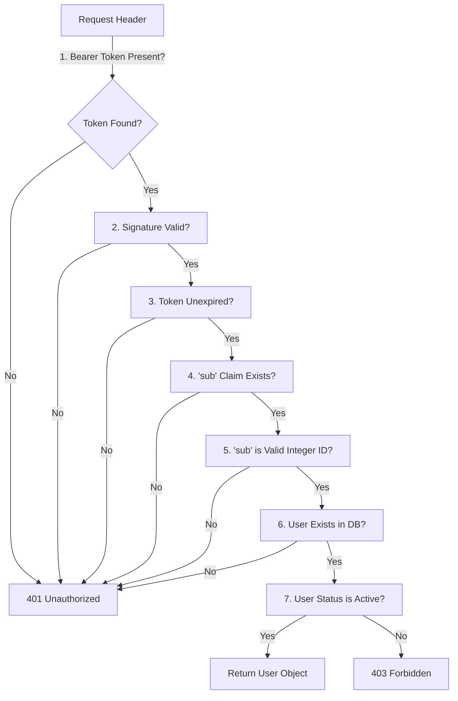

# Phase 6 Technical Documentation: JWT Authentication, Multi-Tenant Isolation & Database Schema Upgrades

Welcome to the technical documentation for **Phase 6** of the **Personal Knowledge Base** system. 

In this phase, we transitioned the application from a single-user prototype into a multi-user, multi-tenant system. We upgraded our database models, created custom database migrations using Alembic, implemented secure user registration and login endpoints, secured our file routes, and wrote a comprehensive suite of integration tests.

If you are a student or junior developer, this document will help you understand password hashing algorithms, state-free session models using JSON Web Tokens (JWT), route-level data isolation, and database migration safety.

---

## 1. Architectural Overview & Design Decisions

### A. Moving to a Multi-Tenant Architecture
Previously, the system acted as a personal document vault where any upload was visible to everyone. In a real-world application, users must only see and manage their own files. 
We achieved this by establishing **multi-tenant isolation**:
- Every user has a unique ID.
- Every file record is stamped with the ID of the user who uploaded it.
- Database queries are filtered at the route level to ensure no user can read or modify another user's metadata.

### B. Stateless Session Design using JWT
Instead of traditional cookie-based sessions where the server stores session IDs in memory or a database, we implemented a **stateless session architecture** using JSON Web Tokens (JWT).

```text
Login Request (Email/Password) ────► Server Verifies
                                          │
Client Stores JWT ◄───────────────────────┴─ Generates Signed JWT
     │
API Request (Bearer Token) ────────► Server Validates Signature (No DB Session lookup needed)
```

- **JWT Lifespan**: Set to a short-lived **30 minutes** (defined in [security.py](file:///d:/Personal_Knowledge_Base/backend/app/core/security.py) as `ACCESS_TOKEN_EXPIRE_MINUTES = 30`).
- **Logout**: Handled completely on the client-side. When a user logs out, the frontend simply discards the stored access token. Since tokens are short-lived, we do not implement a complex server-side token revocation or blocklist database in this phase.
- **JWT `sub` Claim**: The subject (`sub`) claim inside the token stores the user's integer **database ID** (`str(user.id)`) instead of their email address. This decouples the token identity from the user's email, which could change in the future, and speeds up database queries since integer lookups on primary keys are extremely fast.

### C. Password Hashing: Why Argon2id?
Storing plain-text passwords in a database is a major security vulnerability. In this phase, we configured **Argon2id** (via `passlib[argon2]`) instead of standard bcrypt:
- **Argon2id** is the winner of the Password Hashing Competition (PHC) and is widely considered the industry standard.
- Unlike older algorithms, Argon2id is specifically designed to resist brute-force attacks from highly parallel hardware (like GPUs and custom ASIC rigs) by requiring configurable amounts of memory, time, and CPU cores to calculate a hash.

---

## 2. Database Schema & Migration Strategy

### A. ORM Model Refactoring
The SQLAlchemy models defined in [db_models.py](file:///d:/Personal_Knowledge_Base/backend/app/database/db_models.py) were upgraded:

1. **`User` Table**:
   - The legacy `username` column was dropped.
   - The `email` column was updated to `VARCHAR(255)`, set as non-nullable (`nullable=False`), unique, and indexed.
   - The `hashed_password` column capacity was expanded to `VARCHAR(255)` to accommodate long Argon2id hashes.
   - A `status` column (default `"active"`) and `created_at` timestamp were added.
2. **`FileMetadata` Table**:
   - The `userid` column was upgraded to a required foreign key pointing to `users.id` (`nullable=False`, `ondelete="CASCADE"`).
   - Column character limits were reduced to match the frontend character limits introduced in Phase 5 to prevent database column overflows (`title` to 100, `description` to 255, `tags` to 50).

---

### B. Safe Staged Alembic Migration
Making `userid` non-nullable on an existing database can crash the migration if there are pre-existing file records with `userid IS NULL`. 

We implemented a safe migration script in [ce06d2ee9755_phase6_jwt_and_mysql_upgrade.py](file:///d:/Personal_Knowledge_Base/backend/alembic/versions/ce06d2ee9755_phase6_jwt_and_mysql_upgrade.py):
1. **Cleanup Phase**: Before altering column constraints, we execute a SQL command to purge unowned development or test uploads:
   ```python
   op.execute("DELETE FROM file_metadata WHERE userid IS NULL;")
   ```
2. **FK Modification**: We drop the old `SET NULL` foreign key constraint, apply the `NOT NULL` change to `userid`, and then re-add the constraint as `ON DELETE CASCADE`.

---

## 3. Authentication & JWT Validation Pipeline

### A. The 7-Step JWT Validation Pipeline
To safeguard the system's endpoints, we implemented a strict validation pipeline inside the `get_current_user` dependency within [auth.py](file:///d:/Personal_Knowledge_Base/backend/app/auth/auth.py):



---

### B. Basic Single-Instance Rate Limiting
To prevent brute-force login attacks, we implemented a basic, single-instance in-memory rate limiter in [auth.py](file:///d:/Personal_Knowledge_Base/backend/app/apis/routes/auth.py). It tracks failed logins per IP/email using a sliding window:

```python
# backend/app/apis/routes/auth.py
LOGIN_ATTEMPTS: Dict[Tuple[str, str], list[float]] = defaultdict(list)
MAX_LOGIN_ATTEMPTS = 5
RATE_LIMIT_WINDOW_SECONDS = 900  # 15 minutes

def check_rate_limit(client_ip: str, email: str) -> None:
    key = (client_ip, email.lower())
    now = time.time()
    # Filter attempts within the 15-minute window
    LOGIN_ATTEMPTS[key] = [t for t in LOGIN_ATTEMPTS[key] if now - t < RATE_LIMIT_WINDOW_SECONDS]
    if len(LOGIN_ATTEMPTS[key]) >= MAX_LOGIN_ATTEMPTS:
        raise HTTPException(
            status_code=429,
            detail="Too many failed login attempts. Please try again in 15 minutes."
        )
```
*Note: This memory-based tracker is perfect for a single-instance backend deploy, avoiding the complexity of Redis.*

---

## 4. Route Security & Multi-Tenant File Isolation

We secured all endpoints in [upload_file.py](file:///d:/Personal_Knowledge_Base/backend/app/apis/routes/upload_file.py) by injecting `Depends(get_current_user)` and modifying SQL queries to check file ownership:

```python
# Secure file deletion example
@router.delete("/{fileid}", status_code=status.HTTP_200_OK)
async def delete_file(
    fileid: int,
    current_user: User = Depends(get_current_user),
    db: Session = Depends(get_db)
):
    # Enforces that the file must belong to current_user.id
    db_file = db.query(FileMetadata).filter(
        FileMetadata.fileid == fileid,
        FileMetadata.userid == current_user.id
    ).first()
    
    if not db_file:
        raise HTTPException(status_code=404, detail="File record not found or access denied.")
```

### Upload Completion S3 Verification
In `/files/upload-complete`, rather than relying on frontend confirmations, the backend makes an active call to S3/B2 storage using `get_object_metadata(key)` to verify that the file was actually uploaded. The record status is only changed from `pending` to `active` after this check passes.

---

## 5. Testing & Quality Assurance

We implemented an automated test suite in [test_auth_and_files.py](file:///d:/Personal_Knowledge_Base/backend/tests/test_auth_and_files.py).

### Integration Test Sandbox Configuration
Rather than making tests query your real MySQL database (which would create garbage user records and metadata), the test file sets up an **in-memory SQLite database** using SQLAlchemy's `StaticPool`:

```python
# backend/tests/test_auth_and_files.py
SQLALCHEMY_DATABASE_URL = "sqlite:///:memory:"
engine = create_engine(
    SQLALCHEMY_DATABASE_URL,
    connect_args={"check_same_thread": False},
    poolclass=StaticPool, # Shared connection across API request threads
)
```
This isolates tests entirely, ensuring they run in RAM and are automatically destroyed when the test suite completes.

### Scenarios Tested
- **JWT Pipeline Guards**: Tests that missing, invalid, or expired tokens return `401 Unauthorized`, and disabled user accounts return `403 Forbidden`.
- **Multi-Tenant Boundaries**: Confirms that if User A uploads a file, User B receives a `404 Not Found` when trying to edit (`PATCH`), delete (`DELETE`), or view (`view-url`) that file.
- **S3 Validation Failure**: Asserts that `upload-complete` marks files as `"failed"` if the object is missing from the S3 mock.

---

## 6. Development Challenges & Gotchas ("Lessons Learned")

### Gotcha #1: MySQL Error 1830
* **Problem**: Attempting to alter the `userid` column to `NOT NULL` in the migration threw `OperationalError: (1830, "Column 'userid' cannot be NOT NULL: needed in a foreign key constraint 'file_metadata_ibfk_1' SET NULL")`.
* **Reason**: MySQL does not allow a column to be `NOT NULL` while a foreign key is registered with an `ON DELETE SET NULL` rule.
* **Solution**: In the migration script, we explicitly drop the old foreign key constraint *before* running `alter_column`, and re-add the constraint *afterward* with `ondelete="CASCADE"`.

### Gotcha #2: SQLite `:memory:` Thread Isolation
* **Problem**: When hitting route endpoints during integration tests, the server threw `no such table: users` even though tables were created in the test setup.
* **Reason**: SQLite's default memory model creates a completely separate, empty database for each connection/thread. The test thread and the FastAPI server thread were querying different memory databases.
* **Solution**: We configured `poolclass=StaticPool` in the SQLAlchemy test engine. This forces all connections inside the test process to share the exact same SQLite connection in RAM.
